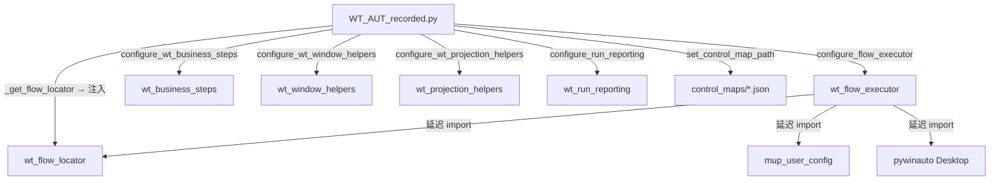

# C1 · 核心运行库

> 本篇回答：**L3 执行运行时层的每个模块负责什么、对外提供什么、有哪些坑**。
> 读者：二次开发者。排障前建议先读卷 B（原理）与 A3（执行链路）。
>
> 约定：本篇只写**模块职责与接口**；算法原理在卷 B，字段字典在卷 E。

---

## 1. 进入本篇前必须知道的一条契约

根级核心库**互相 import**，因此统一采用「模块级 `lambda` 占位 + `configure_*()` 运行时注入 + 函数内延迟 import」的解耦方式（详见 A2 §3）。

| 模块 | 注入入口 |
|---|---|
| `wt_flow_executor` | `configure_flow_executor(...)`（L144，24 个回调） |
| `wt_business_steps` | `configure_wt_business_steps(...)`（L31） |
| `wt_window_helpers` | `configure_wt_window_helpers(...)`（L25） |
| `wt_projection_helpers` | `configure_wt_projection_helpers(...)`（L38） |
| `wt_run_reporting` | `configure_run_reporting(base_dir=None, log_step=None)`（L15） |
| `wt_flow_locator` | 由 `WT_AUT_recorded._get_flow_locator()` 延迟加载后注入执行器 |
| `wt_flow_executor` 控件库路径 | `set_control_map_path(path)`（L53）/ `get_control_map_path()`（L59） |

> 🚧 **改代码时的硬约束**：不要把这些 `lambda` 占位改成直接 import 同层模块，那是被刻意规避的循环依赖。

---

## 2. `wt_flow_executor.py`（2 082 行）· 执行器

| 项 | 内容 |
|---|---|
| 职责 | 解析流程定义 → 调度步骤 → 执行动作 → 重试/降级 → 写报告 |
| 主要入口 | `execute_step_by_id(step_id, execution_plan_map, context, skip_setup=False)`（L1823） |
| 主要内部函数 | `run_action_step`(L1210)、`_run_action_step_with_retry`(L877)、`_try_fallback_chain`(L921)、`run_action_step_with_template_fallback`(L1549)、`try_run_action_step_template_first`(L1673)、`run_flow_ref_step`(L1699)、`is_setup_step`(L1729)、`_eval_precondition_skip`(L484)、`_wait_for_continue_when`(L428)、`_resolve_continue_when`(L348)、`_maybe_run_ai_intervention_after_failure`(L234)、`_write_feedback_to_flow`(L94) |
| 依赖方向 | **不 import 定位器/编排层**，全部靠注入回调；对 `wt_flow_locator`、`pywinauto`、`mup_user_config` 用函数内延迟 import |

**完整链路见 A3 §3，原理见 B5。**

---

## 3. `wt_flow_locator.py`（11 057 行）· 定位器

| 项 | 内容 |
|---|---|
| 职责 | 控件定位、评分、窗口筛选、缓存；**本项目最大模块** |
| 核心函数 | `score_control_match`(L3941)、`get_control_definition_match_score`(L3635)、`wrapper_matches_locator`(L3458)、`_candidate_strict_full_match`(L3873)、`build_fast_locator_queries`、`select_dropdown_item_runtime`、`select_list_items_runtime`、`check_all_toggles_runtime`、`get_wrapper_found_index`、`detect_healed_locator` / `record_self_heal` |
| Raw View 分支 | `control_definition_expects_raw_view`(L5068)、`_iter_raw_view_findall_candidates`(L5164)、`_iter_raw_view_guided_candidates`(L5345)、`iter_raw_view_fallback_candidates`(L5499) |
| 缓存 | `FLOW_WINDOW_CACHE`(60 s)、`FLOW_CONTROL_CACHE`(12 s)、`FLOW_PARENT_CACHE`(20 s)、`_UIPI_BLOCK_CACHE`(3 s)、`_LABEL_RECT_CACHE`(30 s, thread-local)、`_control_map_cache`、`_control_map_index_cache` |
| 对外窗口工具 | `wrap_window_by_handle(handle)`（只包目标窗口自身子树，不做全桌面枚举） |

**评分机制见 B3，底层原理见 B1。**

---

## 4. 动作体系（schema / defaults）

| 模块 | 行数 | 职责 |
|---|---:|---|
| `wt_action_schema.py` | 246 | 19 种动作的 `ACTION_SCHEMAS` + 4 组枚举白名单 + `stepPolicy` ↔ `onError` 映射 + `build_action_schema_hint()` |
| `wt_action_defaults.py` | 28 | `ACTION_DEFAULT_CONFIGS`：各动作的 `timeoutSeconds` / `waitBefore` / `waitAfter`（如 `click`: 2.5 / 0.0 / 0.12；`double_click`: 2.5 / 0.0 / 0.18） |

**模型与枚举见 B2 §3–§5，字段字典见卷 E1。**

---

## 5. `wt_flow_validation.py`（203 行）· 统一校验

| 函数 | 作用 |
|---|---|
| `validate_step_definition(step, package_ids=None)` | 步骤级校验，返回错误列表 |
| `validate_flow_definition(flow_definition)` | 流程级校验（stepId 重复、包 ID 重复、包引用不存在的步骤） |
| `_split_locator_parts(text)` | 按逗号切分并支持 `\,` 转义 |
| `_contains_placeholder_text(value)` | 识别"请补充"/`<...>` 占位值 |

**完整规则清单见 B2 §5.1。**

---

## 6. `wt_business_steps.py`（341 行）· 业务复合步骤

供 Robot 脚本与录制回放脚本使用的**领域复合动作**。通过 `configure_wt_business_steps(...)`（L31）注入依赖，用 `get_step_registry()`（L323）/ `get_step_registry_map()`（L340）暴露注册表。

| 分步函数 | 作用 |
|---|---|
| `step_launch_gm` | 启动 Global Mapper |
| `step_configure_projection` | 配置投影 |
| `step_open_source_dwg` | 打开源 DWG |
| `step_close_unknown_projection` | 关闭"未知投影"对话框 |
| `step_dwg_projection_confirm` | DWG 投影确认 |
| `step_split_layers` | 图层拆分 |
| `step_select_dgx_layer` | 选择 DGX 图层 |
| `step_create_coverage` | 创建 coverage |
| `step_select_coverage_layer` | 选择 coverage 图层 |
| `step_create_grid` | 创建网格 |
| `step_grid_options_ai_fill` | 网格选项中由 AI 填充 |
| `step_export_geotiff` | 导出 GeoTIFF |
| （内部）`_ensure_output_dir_exists` | 保证输出目录存在 |

> 💡 这一族是"地形预处理"子链（Global Mapper → GeoTIFF），是**导入地形图**流程的过程式实现，与声明式 `actionType: "script"` 相配合。

---

## 7. `wt_window_helpers.py`（457 行）· 窗口与对话框辅助

| 函数 | 作用 |
|---|---|
| `is_window_responsive(hwnd, timeout_ms=1000)` | 判断窗口是否响应（避免对假死窗口操作） |
| `find_main_windows(title_re, class_name_keywords=(), exclude_class_keywords=())` | 按标题正则 + 类名关键词枚举主窗 |
| `choose_best_window(windows)` | 在多个候选中挑最佳 |
| `wait_until_main_window_ready(...)` | 等待主窗就绪 |
| `activate_and_maximize_main_window(...)` | 激活并最大化 |
| `ensure_main_window_foreground(...)` | 保证主窗在前台 |
| `click_unknown_projection_if_present(timeout_seconds=8)` | 自动点掉"未知投影"提示 |
| `find_open_dialog` / `confirm_open_file_dialog` | 定位并确认打开文件对话框 |
| `type_path_into_open_dialog(file_path, ...)` | 向打开对话框键入路径 |
| （内部）`_get_window_owning_process_name` / `_restore_if_minimized` | 辅助 |

> 📌 文件对话框是 RPA 的经典难点（`win32` 对话框常不在 UIA 主树里），这一族就是为此存在的。

---

## 8. `wt_projection_helpers.py`（594 行）· 投影、模板与 AI 介入

| 分组 | 函数 |
|---|---|
| **异常** | `StageExecutionError(RuntimeError)`（L15） |
| **AI 介入** | `run_ui_tars(prompt, step_name="AI介入操作")`（L89）；提示词构造 `build_projection_ai_prompt`(L157)、`build_dwg_projection_confirmation_prompt`(L211)、`build_dwg_projection_ai_prompt`(L225) |
| **图像模板** | `get_template_path`(L249)、`locate_template_center`(L254)、`locate_template_center_by_path`(L261)、`_match_template_multiscale`(L306)、`click_template`(L421)、`try_click_layer_tree_expand_icon`(L432) |
| **配置窗** | `find_config_window`(L371)、`config_window_is_open`(L391)、`click_button_in_config_window`(L454)、`configure_projection_by_image`(L482) |
| **诊断** | `capture_debug_screenshot`(L357)、`log_projection_debug_context`(L398) |

**AI 介入细节见 B4 §5；投影的领域约束见 B6 §3①。**

---

## 9. `wt_control_index.py`（319 行）· 控件索引（兼容包装器）

> ⚠️ 模块头已声明"**向后兼容包装器**，新代码请使用 `WT_AUTOMATION_Agent.control_index` 中的函数"。

| 函数 | 作用 |
|---|---|
| `_collect_controls_from_flow(flow_path)` | 从流程定义收集内嵌控件 |
| `_collect_controls_from_master(master_path)` | 从总控件信息收集 |
| `_collect_controls_from_catalog(catalog_path)` | 从标准控件目录收集 |
| `build_control_index_text(...)` | 生成 **LLM 可读**的控件索引文本 |
| `build_compact_control_index(...)` | 紧凑版索引（省 token） |
| `build_dsl_context_for_agent(...)` | 组装给 Agent 的 DSL 上下文 |

**真实实现见 C6 §7。**

---

## 10. `wt_flow_graph.py`（427 行）· 流程链路可视化（只读）

| 成员 | 作用 |
|---|---|
| `load_flow_definition(base_dir, section_key)` | 读取 `flow_definition_<板块>.json` |
| `FlowGraphWindow(tk.Toplevel)` | Canvas 自绘窗口：按 `stepIds` 顺序把每个 step 渲染为**纵向流程卡片**，点击节点弹出该步详情（动作类型、目标控件、键入值…） |
| `round_rectangle(c, x1, y1, x2, y2, r=12, **kw)` | 圆角矩形绘制助手 |

设计取向：**纯 tkinter Canvas 自绘，不引第三方图形库**；只读，不修改流程定义。

---

## 11. `wt_run_reporting.py` / `wt_run_status.py` · 报告与状态

### `wt_run_reporting.py`（165 行）

| 函数 | 作用 |
|---|---|
| `configure_run_reporting(base_dir=None, log_step=None)` | 注入 |
| `start_run_report(steps_to_run, runtime_config)` | 开一轮报告 |
| `report_step_result(run_report, step_id, step_name, status, action_type, strategy, elapsed, error, ...)` | 逐步记录 |
| `finalize_run_report(run_report, status, error="")` | 收尾并落盘 |
| `_ensure_report_dir()` / `_atomic_write_json(path, data)` | `logs/run_reports/`；**原子写**避免半截 JSON |
| `_resolve_final_status(...)` | 终态判定 |

产物：`logs/run_reports/*.json` + `logs/last_run_report.json`（L23–26、L130–148）。

### `wt_run_status.py`（103 行）

| 函数 | 作用 |
|---|---|
| `default_status()` / `load_status()` / `publish(...)` | 读写 `logs/run_status.json`，供总控台/监控轮询 |

**报告字段与排障用法见卷 F1。**

---

## 12. `wt_project_workdir_parser.py`（1 138 行）· 项目工作目录解析

> 纯函数、无 GUI 依赖。用于 **Simple 模式自动解析键入值**。

| 公开入口 | 作用 |
|---|---|
| `parse_project_work_dir(work_dir, project_params=None, flow_path=None)` | 解析工作目录（主入口） |
| `list_mast_entries(work_dir)` | 列出测风塔条目 |
| `summarize_project_work_dir(work_dir, project_params=None)` | 生成摘要 |
| `diagnose_project_work_dir(work_dir)` | 诊断（为什么没解析出东西） |
| `parse_all_masts(work_dir, project_params=None, flow_path=None)` | 解析全部测风塔 |
| `build_text_overrides(flow_path, runtime_config, base_overrides=None)` | 构造文本覆盖 |
| `apply_overrides_to_payload(payload, text_overrides=None, path_prefix_overrides=None)` | 把覆盖应用到流程 payload |
| `load_project_params_from_work_dir(work_dir)` | 读取项目参数 |

**内部识别能力**（部分）：`_is_terrain` / `_is_coords` / `_is_mastdata` / `_is_turbine`、`_is_plausible_utm`、`_read_utm_pair`、`_extract_projection_abbrev`、`_parse_cft_info_file`、`_parse_tim_header`、`_parse_wtg_height` / `_parse_wtg_filename` / `_parse_wtg_meta`、`_collect_mast_ids`。

---

## 13. `wt_spatial_domain_calc.py`（444 行）· 空间计算域

| 成员 | 作用 |
|---|---|
| `SpatialPoint`（L24） | 空间点数据类 |
| `parse_coordinate_file(file_path, category=None)` | 解析坐标文件 |
| `parse_points_from_input_dir(dir_path)` | 从输入目录批量解析 |
| `calculate_spatial_domain(...)` | **计算空间计算域** |
| `inject_into_flow_definitions(...)` | 把结果注入流程定义 |
| `build_spatial_text_overrides(...)` | 构造文本覆盖 |
| `format_calculation_report(calc_result)` | 生成可读计算报告 |
| `main()` | 命令行入口 |

**领域约束（覆盖必须超出 `1.2×√2×R + 2000 m`）见 B6 §3②。**

---

## 14. `wt_mast_config_xml.py`（223 行）· 测风塔配置 XML

采用**固定模板注入式**设计（2026-09-04 定稿）。

| 函数 | 作用 |
|---|---|
| `probe_tim_column_headers(tim_path)` | 探查 `.tim` 文件的列头（决定列映射） |
| `build_mast_config_xml(tim_path, mast_name, hub_height, output_dir=None, ...)` | 生成 XML 配置内容 |
| `save_mast_config_xml(...)` | 保存 |
| `main(argv=None)` | CLI 入口 |
| （内部）`_read_text_head` / `_esc` | 读文件头 / XML 转义 |

---

## 15. 依赖注入接线总表（速查）

---

核验：2026-09-11 / 涉及：`wt_flow_executor.py`、`wt_flow_locator.py`、`wt_action_schema.py`、`wt_action_defaults.py`、`wt_flow_validation.py`、`wt_business_steps.py`、`wt_window_helpers.py`、`wt_projection_helpers.py`、`wt_control_index.py`、`wt_flow_graph.py`、`wt_run_reporting.py`、`wt_run_status.py`、`wt_project_workdir_parser.py`、`wt_spatial_domain_calc.py`、`wt_mast_config_xml.py`
