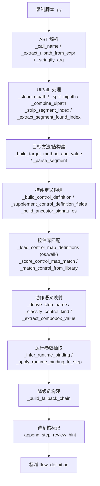

# C4 · 流程包 · 录制转换 · Excel 数据资产

> 本篇回答：**流程定义存在哪、注册表怎么工作、录制脚本怎么变成流程、Excel 怎么双向往返、参数矩阵怎么组织**。
> 读者：流程编写者、批量维护流程的人。
>
> 数据模型本身在 B2 §2；本篇讲**资产的组织与转换管线**。

---

## 1. 资产全景

`flow_packages/` 共 **40 个文件**，其中 23 个 `.json`。

| 类别 | 内容 |
|---|---|
| **流程定义** | `flow_definition_<板块>.json`（25 份），如 `创建一个新建模`、`导入地形图`、`导入并配置元素`、`导入测风塔、机位点`、`发送CFD计算`、`发送综合计算`、`导出综合计算结果`、`新建风机类型` … |
| **注册表** | `flow_package_registry.json`（**聚合仓库**） |
| **环境变体** | `flow_definition_新建气象数据_内网.json` / `_外网.json` / `_内网_配置导入.json` / `_外网_配置导入.json` |
| **备份** | `*.bak_<场景>_<日期>`，如 `.bak_step5_20260804`、`.bak_before_wait_fix`、`.bak_20260902` |
| **参数矩阵** | `param_table_发送综合计算.json` / `.xlsx` / `_单塔备份_20260828.xlsx` |
| **转换产物** | `converted_recorder_flows/`（录制转换输出） |
| **录入步骤** | `气象数据录入_CFE02_steps.json`、`气象数据录入_steps.xlsx` |
| **样例** | `simple_terrain_20260804_135057.json`、`flow_definition_测试*.json` |

**命名约定**：`flow_definition_<板块>.json`；备份 `*.bak_<场景>_<日期>`；参数矩阵 `param_table_<板块>.json|xlsx`。

---

## 2. 注册表 `flow_package_registry.json`

### 2.1 结构

顶层字段（实测）：

```
version / project / description /
sourceDefinitionPath / storageDir / runtimeConfig /
flowPackages[] / steps[] / lastUpdated
```

| 字段 | 说明 |
|---|---|
| `sourceDefinitionPath` | 来源流程定义路径 |
| `storageDir` | 存储目录 |
| `runtimeConfig` | 运行时配置 |
| `flowPackages[]` | 流程包列表：`{id, name, description, stepIds[]}` |
| `steps[]` | **全量步骤**（聚合副本） |

包条目示例：

```json
{
  "id": "发送综合计算",
  "name": "发送综合计算",
  "description": "（已剔除 step_1..27 计算步骤，仅保留导出链路）",
  "stepIds": ["step_1", "step_2", …]
}
```

> 📌 注册表本身带一份 `steps[]` 聚合副本，因此它是**可直接执行的完整 payload**，不只是索引。

### 2.2 同步机制

| 场景 | 机制 |
|---|---|
| 编辑器保存 | `WT_Flow_Editor.sync_flow_package_registry(source_definition_path, runtime_config, flow_packages, steps)`（L894）自动同步，**无需手改大文件** |
| 编辑器切换流程 | `sync_launcher_flow_definition_path(source_definition_path)`（L924）同步总控台当前路径 |
| 总控台读取 | `WT_Launcher.load_effective_flow_payload(...)`（L339）把**目标流程**与**注册表**合并成有效 payload（`_merge_target_with_registry`，L298） |

---

## 3. 录制转换 `flow_recorder_converter.py`（2 527 行）

把 pywinauto recorder 的录制脚本**自动转换成标准流程定义**，是"上手最快"的路径。

### 3.1 转换管线



### 3.2 关键函数

| 分组 | 函数 | 行号 |
|---|---|---|
| **UIPath** | `_clean_uipath`(L95)、`_combine_uipath`(L99)、`_split_uipath`(L111)、`_strip_segment_index`(L115)、`_extract_segment_found_index`(L127)、`_parse_segment`(L144)、`_find_window_title`(L154)、`_get_leaf_segment`(L165) | |
| **定位构建** | `_build_target_method_and_value`(L172)、`_split_target_value`(L185) | |
| **控件定义** | `_clean_control_definition`(L207)、`_build_control_definition`(L708)、`_supplement_control_definition_fields`(L825)、`_apply_control_definition_to_step`(L854)、`_build_ancestor_signatures`(L692) | |
| **控件库匹配** | `_load_control_map_definitions`(L234， **`os.walk` 递归**)、`_score_control_map_match`(L303)、`_match_control_from_library`(L416) | |
| **语义推断** | `_derive_step_name`(L476)、`_is_generic_click_target`(L465)、`_classify_control_kind`(L599)、`_extract_combobox_value`(L616)、`_normalize_send_keys_text`(L582) | |
| **运行参数** | `_infer_runtime_binding`(L643)、`_apply_runtime_binding_to_step`(L671) | |
| **降级与复核** | `_build_fallback_chain`(L887)、`_append_step_review_hint`(L628) | |
| **候选留存** | `_save_control_candidate`(L935) → `control_maps/_candidates/` | |
| **步骤/ID** | `_sanitize_step_id`(L510)、`_unique_step_id`(L515)、`_build_action_step_base`(L989) | |
| **时序** | `_build_action_timing_config`(L52) | |

### 3.3 三个值得记住的设计

| 设计 | 说明 |
|---|---|
| **`foundIndex` 保留** | UIPath 段尾的 `#[范围,N]` 序号**必须保留**为 `inspectData.foundIndex`（此前被 `_strip_segment_index` 直接丢弃）。它是后期消歧的重要资产 |
| **路径常量提升为运行参数** | `_infer_runtime_binding` 把明显的文件路径常量识别出来，提升为运行参数占位，使流程可跨项目复用 |
| **待复核标记** | 转换不确定处打 `_append_step_review_hint`，人工复核时按图索骥 |

> ⚠️ **契约提醒**：`_clean_control_definition` 会把 `inspectData` 的值统一 `normalize`（int → str），**运行时必须用 `int()` 容错解析**（B3 的 `found_index_expected` 解析就是这么写的）。

> ⚠️ **已知技术债**：`_load_control_map_definitions`（~L246）静默吞异常无日志，控件库读取失败时表现为"匹配不到"而非报错，排障困难。

---

## 4. Excel 往返 `flow_excel_io.py`（1 503 行）

### 4.1 定位

让**非开发人员**也能批量维护流程：把流程定义导出成带**下拉校验、动作指引、示例页**的 Excel，改完再导入。

### 4.2 主要接口

| 函数 | 行号 | 作用 |
|---|---|---|
| `export_flow_to_excel(flow_json_path, excel_path, selected_step_ids=...)` | L1001 | 导出 |
| `load_flow_payload_from_excel(excel_path)` | L1351 | 从 Excel 载入 payload |
| `import_flow_from_excel(excel_path, flow_json_path)` | L1467 | 导入并写回 JSON |
| `load_flow_excel_meta(excel_path)` | L305 | 读取 Excel 元信息 |
| `audit_flow_excel_roundtrip(...)` | L436 | **往返一致性审计** |
| `compare_roundtrip_fields_between_payloads(baseline, candidate, step_ids)` | L338 | 对比两份 payload 的字段差异 |
| `format_roundtrip_audit_report(...)` | L398 | 生成审计报告 |
| `build_arg_parser()` / `main()` | L1473 / L1488 | CLI |

### 4.3 工作表结构

| Sheet | 生成函数 | 内容 |
|---|---|---|
| 主表 | — | 步骤与字段（含下拉校验 `_apply_list_validation`、表头注释 `_annotate_sheet_headers`、图例行 `_append_legend_rows`、自适应列宽 `_autofit_sheet`） |
| **动作指引** | `_create_action_guide_sheet`(L846) | 19 种动作的填写说明 |
| **示例** | `_create_examples_sheet`(L896) | 填写范例 |
| **选项表** | `_write_options_sheet`(L970) | 供下拉校验引用的枚举选项（`_build_option_lists`，L809） |

### 4.4 ⚠️ Excel 往返五处同步（硬纪律）

> 新增一个字段要同时改 **列定义 / 规范化 / 写出 / 读入 / 清理** 五处，**缺一处就往返丢数据**。

| # | 位置 |
|---|---|
| 1 | 列定义（`_set_sheet_headers` / 表头注释） |
| 2 | 规范化（`_normalize_payload`(L621)、`_to_bool` / `_safe_text` / `_safe_number`） |
| 3 | 写出（`export_flow_to_excel` / `_extract_engineering_step_fields`(L747)） |
| 4 | 读入（`_merge_step_inspect_hints`(L1228)、`_merge_step_action_config`(L1255)） |
| 5 | 清理（`_cleanup_step_payload`(L1338)） |

**审计兜底**：`audit_flow_excel_roundtrip` 会在导出→导入后对比字段，发现丢失即报——新增字段后**务必跑一次**。

---

## 5. 参数矩阵（批量数据驱动）

| 资产 | 说明 |
|---|---|
| `param_table_发送综合计算.json` / `.xlsx` | 参数矩阵定义（同名双模，json 供程序、xlsx 供人工） |
| `param_table_发送综合计算_单塔备份_20260828.xlsx` | 分场景备份 |

**运行时展开**：`WT_AUT_recorded._apply_param_table_expansion(merged_payload, target_payload)`（L738）把矩阵展开为多轮执行。

> 📌 **占位符空值陷阱**：`_resolve_dynamic_value` 的 runtime 分支对空串/None **保留字面量**（这是为了防止 `send_keys` 吃掉 `{}` 花括号）。名单类动作若把字面量 `${runtime.xxx}` 当数据就会误失败。
> **修复范式**：名单类动作（如 `select_list_items`）在入口检测 `${` 前缀 → 记警告并按"全选/默认语义"处理（未指定 = 全量）。**不要改 resolver 的空值保护**，那会影响所有文本键入。

---

## 6. 备份与变体管理

| 机制 | 说明 |
|---|---|
| `.bak_<场景>_<日期>` | 手工/自动备份。修改流程前先备份是本项目惯例（如 `.bak_before_wait_fix`、`.bak_step9_20260804`） |
| 环境变体 | `_内网` / `_外网` / `_配置导入` 后缀区分不同目标环境 |
| 注册表聚合 | 注册表本身带 `steps[]` 副本，可视为一次聚合快照 |
| 归档 | `release_out/` 保留最近 14 个发布点（与流程资产无关，但是同一套"留痕"习惯） |

---

## 7. 维护纪律

| # | 纪律 |
|---|---|
| 1 | 改流程前先 `.bak_<场景>_<日期>` |
| 2 | 新增字段：Excel 五处同步 + `normalize_step` 白名单放行 + 跑一次往返审计 |
| 3 | 保存流程走编辑器（自动同步注册表），**不要手改 `flow_package_registry.json`** |
| 4 | 录制转换后**必须处理待复核项**，不要把 `_append_step_review_hint` 的提示留着不处理 |
| 5 | 参数矩阵优先用 `param_table_<板块>.json|xlsx` 双模，json 给程序、xlsx 给人 |
| 6 | 名单类动作注意占位符空值陷阱（见 §5） |

---

核验：2026-09-11 / 涉及：`flow_packages/`（40 文件）、`flow_package_registry.json`、`flow_recorder_converter.py`(L52–1045)、`flow_excel_io.py`(L228–1488)、`WT_Flow_Editor.py`(L894, L924)、`WT_Launcher.py`(L298, L339)、`WT_AUT_recorded.py`(L738)、`tests/test_flow_excel_io.py`、`tests/test_flow_recorder_converter.py`、`tests/test_param_matrix.py`
