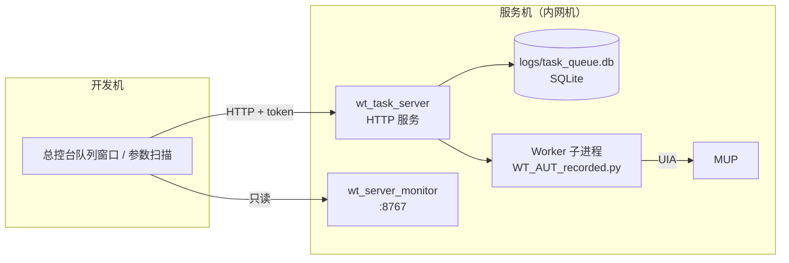

# C5 · 远程任务队列与运行监控

> 本篇回答：**无人值守机上任务怎么投递、怎么排队、怎么执行、怎么看**。
> 读者：运维、要用内网机跑批量的人。
>
> 详细操作步骤在卷 D6；本篇讲**组件职责与状态模型**。

---

## 1. 部署形态与组件



| 模块 | 行数 | 角色 |
|---|---:|---|
| `wt_task_queue.py` | 1 481 | SQLite 持久化队列（**仅标准库**） |
| `wt_task_server.py` | 1 952 | HTTP 服务 + worker 拉起 |
| `wt_task_queue_window.py` | 2 966 | 「队列 + 服务器监控」统一客户端窗口（嵌总控台） |
| `wt_server_monitor.py` | 202 | 只读监控服务 |
| `wt_queue_selfcheck.py` | 251 | 一键自检 |

> 📌 **设计前提**：队列服务与 worker 在**同一台主机**，因此双方都直接打开本地 SQLite 库，不需要跨机数据库。这也是"不是集群调度器"的边界（A1 §4）。

---

## 2. 任务模型 `wt_task_queue.py`

### 2.1 存储与常量

| 常量 | 值 |
|---|---|
| `DEFAULT_DB_PATH` | `logs/task_queue.db` |
| `DEFAULT_TASK_LOG_DIR` | `logs/tasks` |
| `DEFAULT_TAIL` | 300 |

### 2.2 状态机

```
STATUS_PENDING → STATUS_RUNNING → STATUS_SUCCESS
                              ↘ STATUS_FAILED
                              ↘ STATUS_TERMINATED
                              ↘ STATUS_PAUSED → (resume) → PENDING/RUNNING
              ↘ STATUS_CANCELED
```

| 状态 | 常量 | 说明 |
|---|---|---|
| `pending` | `STATUS_PENDING` | 等待 |
| `running` | `STATUS_RUNNING` | 执行中 |
| `paused` | `STATUS_PAUSED` | 已暂停 |
| `success` | `STATUS_SUCCESS` | 成功 |
| `failed` | `STATUS_FAILED` | 失败 |
| `canceled` | `STATUS_CANCELED` | 已取消 |
| `terminated` | `STATUS_TERMINATED` | 已终止 |

### 2.3 主要接口

| 分组 | 函数 |
|---|---|
| **初始化** | `init_db(db_path, force=False)`、`_init_db_once`、`_ensure_columns`、`_connect` |
| **提交** | `submit_task(...)`、`submit_tasks_batch(tasks_specs, ...)` |
| **查询** | `get_task(task_id)`、`list_tasks(user, scope, limit, task_ids, ...)`、`get_queue_stats()` |
| **调度** | `claim_next_pending()`、`mark_started(task_id, run_id, ...)` |
| **推进** | `update_progress(...)` |
| **终态** | `mark_success`、`mark_failed`、`mark_paused`、`mark_terminated` |
| **控制** | `request_pause`、`request_terminate`、`cancel_task`、`delete_task`、`resume_task` |
| **失败处理** | `schedule_retry(task_id, error, ...)`、`handle_failure(task_id, error, ...)` |
| **自愈** | `recover_orphan_running_tasks(db_path, max_age_seconds=120)` |
| **日志** | `append_task_log`、`read_task_log_tail`、`task_log_path`、`cleanup_task_logs` |
| **审计** | `add_audit_event`、`list_audit_events` |
| **归档** | `archive_completed_tasks(days=30, limit=1000, ...)` |
| **ETA** | `calculate_task_eta(task)`、`estimate_task_eta(task_id, ...)` |
| **环境** | `check_desktop_interactive()` |

> 💡 `recover_orphan_running_tasks` 是**必须的**：worker 进程若被强杀，任务会永远卡在 `running`。默认超过 **120 秒**无进展即视为孤儿并回收。

### 2.4 其他要点

- `_row_to_task(row)`：行 → 任务字典；
- `TaskStateError(Exception)`：非法状态迁移时抛出（状态守卫）；
- `check_desktop_interactive()`：检查当前是否**可交互桌面会话**——无人值守场景下这是能否驱动 UI 的前提。

---

## 3. HTTP 服务 `wt_task_server.py`

| 成员 | 行号 | 说明 |
|---|---|---|
| `TaskQueueHandler(BaseHTTPRequestHandler)` | L242–1477 | 全部 HTTP 端点实现 |
| `TaskServer(ThreadingHTTPServer)` | L1478 | 多线程服务 |
| `default_worker_launcher(...)` | L163 | 拉起 worker（`WT_AUT_recorded.py`） |
| `create_server(...)` / `serve_forever(...)` | L1880 / L1907 | 启动 |
| `main()` | L1932 | CLI 入口 |

### 3.1 服务端能力

| 能力 | 函数/说明 |
|---|---|
| **鉴权** | token 校验（token 由启动参数/配置提供，**禁止入库**） |
| **流程版本台账** | `_load_flow_version_ledger` / `_save_flow_version_ledger` / `_version_file_name` / `_sha256_text`——记录流程文件版本与校验和，保证 worker 跑的是预期版本 |
| **参数校验** | `_coerce_int_field(payload, name, default, min_value)` |
| **定时投递** | `_normalize_scheduled_at(value)` |
| **回调通知** | `_validate_notify_url(value)` |
| **服务日志** | `log_server_event(message, log_path=DEFAULT_SERVER_LOG)` |

### 3.2 ⚠️ 远程一致性的核心纪律

> **worker 必须以"任务携带的 flowPath 与项目参数"为准，不能读本机默认流程。**

否则会出现"投递的是 A 流程、跑起来却是 B 流程"。这是本项目踩过的坑（见 `docs/02-会话沉淀/会话沉淀_远程流程一致性_worker消费flowPath与任务携带项目参数_20260903.md`），对应回归测试 `tests/test_remote_flow_parity.py`。

---

## 4. 监控服务 `wt_server_monitor.py`（202 行）

| 成员 | 行号 |
|---|---|
| `MonitorHandler(BaseHTTPRequestHandler)` | L40 |
| `MonitorServer(ThreadingHTTPServer)` | L149 |
| `create_server(...)` | L166 |
| `serve_forever(host="0.0.0.0", port=8767)` | L182 |
| `main()` | L193 |

定位：**只读**监控端点（队列状态、日志尾部），供总控台的 `ServerMonitorWindow`（`WT_Launcher.py` L1611）拉取展示。

---

## 5. 一键自检 `wt_queue_selfcheck.py`（251 行）

把"启动服务 + 健康检查 + 连通检测"自动化，**只留输入服务器 IP 这一步手动**。

| 函数 | 作用 |
|---|---|
| `port_open(host, port, timeout=2)` | 端口连通 |
| `http_get(url, token=None, timeout=4)` | 带 token 的 HTTP 探测 |
| `wait_service(host, port, token, path, seconds=15)` | 等待服务就绪 |
| `local_ipv4s()` | 列出本机 IPv4（避免填错地址） |
| `ensure_service(script, port, token, name)` | 保证服务在跑 |
| `cmd_server(token)` / `cmd_check(host, token)` / `cmd_stop()` | 子命令 |
| `_kill_by_port(port)` | 按端口终止进程 |
| `ask_yes_no` / `main()` | 交互与入口 |

**典型用法**：

```bash
# 服务器端
python wt_queue_selfcheck.py --server [--token 令牌]
# 客户端
python wt_queue_selfcheck.py --check <服务器IP> [--token 令牌]
```

---

## 6. 队列窗口 `wt_task_queue_window.py`（2 966 行）

「队列 + 服务器监控」的**统一客户端窗口**，供 `WT_Launcher` 嵌入使用。

已知关注点（对应测试）：

| 测试文件 | 关注的点 |
|---|---|
| `test_wt_task_queue_window.py` | 基本行为 |
| `test_wt_task_queue_window_incremental_render.py` | **增量渲染**（任务多时不能每帧全量重绘） |
| `test_wt_task_queue_window_theme_integration.py` | 与 `wt_theme` 的集成 |

---

## 7. 运行前置条件（最容易踩）

| 条件 | 说明 | 诊断工具 |
|---|---|---|
| **同会话** | worker 与 MUP 必须处于**同一 Windows 会话**，否则 `EnumWindows` 看不到窗口 | `diagnose_session.py` |
| **可交互桌面** | 不能在服务会话/锁屏下驱动 UI | `wt_task_queue.check_desktop_interactive()` |
| **提权一致（UIPI）** | MUP 管理员运行时，worker 也需提权 | `WT_Launcher._runs_target_elevated()` 等 |
| **RDP 会话存活** | 断开远程桌面会导致 UI 树与渲染失效 | 运维侧保证 |
| **服务常驻** | 队列服务需要在服务机上常驻 | `start_queue_service.bat` / `wt_queue_selfcheck` |

> 📌 **一键修复**：`服务器一键会话修复.bat` 专门用于修复远程机会话问题；`check_queue_link.bat` 做连通性检查。

---

## 8. 运维脚本矩阵

| 脚本 | 用途 |
|---|---|
| `start_queue_service.bat` / `check_queue_link.bat` | 队列服务启动 / 连通性检查 |
| `服务器一键会话修复.bat` | 远程机会话修复 |
| `验证环境_内网.bat` | 内网环境验证 |
| `wt_queue_selfcheck.py --server / --check` | 一键自检（服务侧 / 客户端） |

---

## 9. 已知约束与边界

| 约束 | 说明 |
|---|---|
| **不是集群调度器** | 面向单台无人值守机；队列服务与 worker 同机直连 SQLite |
| **无多机分发** | 需要多机时只能各自部署、各自投递 |
| **依赖可交互会话** | UI 自动化的固有前提；RDP 断连/锁屏会导致失败 |
| **token 明文配置** | 通过启动参数/配置提供，**禁止写入版本库** |

---

核验：2026-09-11 / 涉及：`wt_task_queue.py`(L19–31, L168–1477)、`wt_task_server.py`(L44–1932)、`wt_server_monitor.py`(L40–193)、`wt_queue_selfcheck.py`(L33–223)、`wt_task_queue_window.py`、`WT_Launcher.py`(L1611)、`tests/`（test_wt_task_queue*、test_wt_task_server*、test_remote_flow_parity、test_simple_remote_p0/p1）
