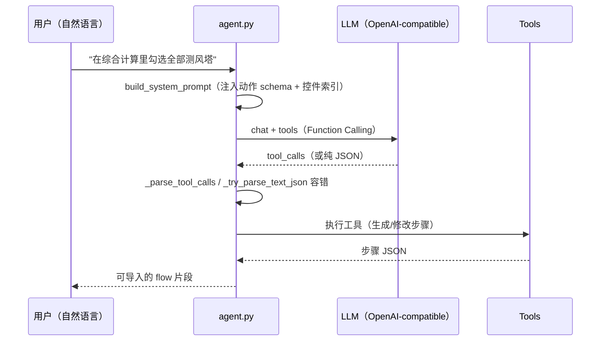

# C6 · AI 助手与 DSL Agent

> 本篇回答：**`WT_AUTOMATION_Agent/` 里 17 个模块各自做什么、NL→DSL 怎么实现、技能系统怎么扩展**。
> 读者：要用 Agent 生成/审计/修复流程的人，以及要扩展 Agent 的人。
>
> 操作步骤在卷 D7；本篇讲**组成与机制**。

---

## 1. 定位与边界

| 项 | 说明 |
|---|---|
| 子系统位置 | `WT_AUTOMATION_Agent/`（74 文件，其中 **17 个 `.py`** + **11 份 `skills/*.md`**） |
| 边界 | **不替代执行器**。Agent 产出/修改的是**流程定义本身**与**检索结果**，真正驱动 MUP 的仍是 L3 执行链路 |
| 与主线的关系 | 主线不 import Agent；根级 `wt_dsl_agent.py`(41 行) 与 `wt_control_index.py`(319 行) 是**向后兼容包装器**，真实实现在本包内 |
| 可缺失性 | Agent 与 UI-TARS 都是**可选能力**：缺失时主线自动化照常运行 |

---

## 2. 模块清单

| 模块 | 大小 | 职责 |
|---|---:|---|
| `gui.py` | 131 KB | 图形界面入口 |
| `agent.py` | 74 KB | Agent 主逻辑（NL→DSL） |
| `parameter_scan.py` | 39 KB | 参数矩阵扫描 |
| `control_search.py` | 29 KB | 控件语义检索 |
| `flow_repair.py` | 21 KB | 流程修复（用控件库回填控件定义） |
| `skill_bridge.py` | 16 KB | 技能发现与加载 |
| `flow_audit.py` | 13 KB | 流程审计 |
| `flow_ops.py` | 11 KB | 流程读取/文本化/差异/补丁 |
| `schemas.py` | 11 KB | 动作 schema 镜像 |
| `knowledge_base.py` | 10 KB | 知识库（分块检索） |
| `history_store.py` | 8 KB | 会话历史持久化 |
| `control_index.py` | 7 KB | 控件索引（LLM 可读文本） |
| `cli.py` | 7 KB | 命令行入口 |
| `model_profiles.py` | 4 KB | 模型档案 CRUD |
| `log_diagnosis.py` | 3 KB | 日志/报告诊断 |
| `memory.py` | 3 KB | 上下文压缩 |
| `__init__.py` | 2 KB | 包入口（`start_gui`） |

---

## 3. NL→DSL Agent（`agent.py`）

架构：**轻量级 OpenAI-compatible Function Calling**。

| 成员 | 行号 | 作用 |
|---|---|---|
| `DslAgentConfig` | L64 | 配置（base_url / api_key / model / 温度等） |
| `DslContext` | L124 | DSL 上下文（动作名、控件索引、当前流程摘要） |
| `_executor_action_names()` | L158 | 从执行器取可用动作名（**与主线保持同步**） |
| `_build_tools_definition()` | L163 | 构造 Function Calling 的 tools 定义 |
| `build_system_prompt(context)` | L458 | 系统提示词（把 schema 与控件语义注入） |
| `_build_session(config)` / `_get_session(config)` | L575 / L605 | `requests.Session` 复用 |
| `_call_llm(...)` | L613 | 调用 LLM |
| `_parse_tool_calls(response)` | L650 | 解析工具调用 |
| `_extract_json_array(text)` / `_try_parse_text_json(content)` | L678 / L699 | **容错解析**（模型可能直接吐 JSON 数组而非工具调用） |

> 💡 **为什么是 Function Calling 而不是纯提示词**：结构化输出可校验、可回灌进编辑器；同时保留 `_try_parse_text_json` 兜底，兼容"模型不按格式来"的情况。

---

## 4. CLI（`cli.py`）

| 函数 | 行号 | 作用 |
|---|---|---|
| `build_arg_parser()` | L20 | 参数解析 |
| `list_schemas()` | L85 | 列出动作 schema |
| `list_skills()` | L105 | 列出已加载技能 |
| `main()` | L119 | 入口 |
| `_wrap_flow(steps)` | L196 | 把步骤数组包成完整流程 payload |

---

## 5. GUI（`gui.py`，131 KB）

图形界面入口，提供会话式交互：选择模型档案、加载技能、生成/审计/修复流程、查看历史会话。
由 `__init__.start_gui(port=None, open_browser=True)`（L79）启动。

> 📌 GUI 与 `WT_Launcher` 是**两个独立进程**（`启动WT_AI助手.bat` 单独启动），不嵌入总控台。

---

## 6. 技能系统（`skill_bridge.py`）

技能是 Agent 的**软知识**，以文件形式放在 `WT_AUTOMATION_Agent/skills/`。

| 函数 | 行号 | 作用 |
|---|---|---|
| `SkillInfo` | L27 | 技能元数据 |
| `discover_skills(skill_dirs)` | L58 | 发现技能文件 |
| `_load_skill_file(file_path)` | L93 | 按扩展名分派 |
| `_load_md_skill` / `_load_json_skill` / `_load_xlsx_skill` / `_load_csv_skill` / `_load_pdf_skill` / `_load_docx_skill` | L136 / L113 / L171 / L212 / L237 / L251 | 各格式加载器 |
| `get_builtin_skills()` | L341 | 内置技能 |
| `load_all_skills_text(...)` | L366 | 汇总为提示词文本 |

### 6.1 现有 11 份技能

| 技能 | 用途 |
|---|---|
| `step_authoring_best_practices.md` | **步骤编写规范**（写步骤必读） |
| `excel_column_mapping.md` | Excel 列映射 |
| `meteodyn_wt_domain.md` | MUP 领域知识 |
| `multi_parameter_scan.md` | 多参数扫描 |
| `flow_audit.md` | 流程审计要点 |
| `template_auto_association.md` | 模板自动关联 |
| `asset_assisted_flow_building.md` | 资产辅助的流程构建 |
| `agent_usage_guide.md` | Agent 使用指南 |
| `agent_architecture.md` | Agent 架构说明 |
| `agent_troubleshooting.md` | Agent 排障 |
| `debug_lessons_learned.md` | 调试经验教训 |

> 💡 新增知识**优先写成 skill 文件**，而不是改代码——这是本子系统最重要的扩展方式。

---

## 7. 控件检索（`control_index.py` / `control_search.py`）

两者分工不同：

| 模块 | 产出 | 用途 |
|---|---|---|
| `control_index.py`（7 KB） | **LLM 可读文本** | 塞进提示词 |
| `control_search.py`（29 KB） | **结构化检索** | 程序化查找、树导航 |

### `control_index.py`

| 函数 | 行号 |
|---|---|
| `build_index_from_controls(controls)` | L18 |
| `build_index_from_json(json_path)` | L54 |
| `build_builtin_index()` | L176 |
| `build_context_for_agent(...)` | L185 |

### `control_search.py`

| 函数 | 行号 | 作用 |
|---|---|---|
| `_load_master_overlay(controls)` | L125 | 加载总控件信息覆盖层 |
| `_load_standard_catalog(controls)` | L179 | 加载标准目录 |
| `_load_library_dir(controls)` | L210 | 加载 `library/` |
| `_fill_gaps(dest, src)` | L258 | **用高质量记录填补低质量记录的空缺字段** |
| `_load()` / `reload()` | L268 / L313 | 载入与重载 |
| `_TreeNode` / `_split_uipath` / `_build_tree` | L323 / L332 / L339 | 按 UIPath 构建树，支持层级导航 |
| `_norm_record` / `_control_key` | L86 / L244 | 归一化与去重键 |

> 📌 `_fill_gaps` 是很有价值的设计：同一控件在多个快照里字段残缺程度不同，用它做字段级互补。

---

## 8. 流程审计 / 修复 / 编辑

### `flow_audit.py`（13 KB）

| 函数 | 行号 |
|---|---|
| `audit_flow(flow)` | L62（主入口） |
| `_find_embedded_control(step, control_id)` | L36 |
| `_issue(step_index, step_name, level, category, ...)` | L232 |
| `_split_locator_parts(text)` | L21 |

产出分级问题清单（level / category），供人工或 Agent 消费。

### `flow_repair.py`（21 KB）

用**控件库**回填步骤里残缺/过期的控件定义。

| 函数 | 行号 | 作用 |
|---|---|---|
| `load_flat_controls(master_control_file)` | L38 | 加载扁平控件表 |
| `extract_step_control_aid(control)` | L55 | 提取 automationId |
| `pick_library_match(...)` | L69 | 在库里挑最佳匹配 |
| `apply_library_definition(control, rec)` | L111 | 应用库定义 |
| `_is_svg_path_like(text)` / `clean_display_name(text)` / `_pick_display_name(control)` | L150 / L158 / L170 | 名称清洗（SVG path 处理） |
| `_auto_item` / `_pending_item` | L187 / L199 | 自动生成项 / 待处理项 |
| `_index_flat_controls` | L210 | 建索引 |
| `_repair_control_name(control, step_index, ...)` | L220 | 修复控件名 |

### `flow_ops.py`（11 KB）

| 函数 | 行号 | 作用 |
|---|---|---|
| `load_flow(path)` | L21 | 载入流程 |
| `flow_to_text(flow, max_steps=300, include_controls=False)` | L98 | 流程 → 文本（供 LLM / 人读） |
| `_step_summary` / `_control_summary` | L75 / L37 | 摘要 |
| `diff_flows_structural(flow_a, flow_b)` | L129 | **结构化差异** |
| `apply_edit_patch(flow, patches)` | L193 | 应用编辑补丁 |
| `_validate_patch_step_action(patch)` | L177 | 补丁校验 |
| `normalize_edit_result(result, original_steps)` | L243 | 结果归一化 |

---

## 9. 参数扫描（`parameter_scan.py`，39 KB）

| 成员 | 行号 | 作用 |
|---|---|---|
| `ScanConfig` | L57 | 扫描配置 |
| `ParameterRow` | L45 | 一行参数 |
| `ScanResult` | L72 | 扫描结果 |
| `ParameterScanner` | L97 | 扫描器主体 |
| `StepModeFilterUnavailable(ValueError)` | L31 | 步骤模式过滤不可用异常 |
| `_apply_step_cell(step, col, val)` | L839 | 把单元格值写入步骤字段 |

> 📌 与 `WT_AUT_recorded._apply_param_table_expansion`（L738）配合：前者负责**构造组合**，后者负责**运行时展开**。

---

## 10. 支撑模块

### `knowledge_base.py`（10 KB）

| 成员 | 行号 | 作用 |
|---|---|---|
| `KnowledgeBase` | L72 | 知识库主体 |
| `_tokenize(text)` | L44 | 分词 |
| `_chunk_text(text, max_chars=1200)` | L56 | 分块（1200 字） |
| `get_knowledge_base()` / `rebuild()` / `build_edit_knowledge_base()` | L251 / L259 / L269 | 获取 / 重建 / 构建编辑用知识库 |

### `history_store.py`（8 KB）

会话持久化：`Conversation`(L36)、`create_conversation`(L188)、`add_message`(L199)、`list_conversations`(L97)、`load_conversation`(L121)、`save_conversation`(L135)、`delete_conversation`(L151)、`rename_conversation`(L163)、`_cleanup_old_sessions`(L173)。

### `memory.py`（3 KB）

上下文压缩：`split_for_compression(messages, recent_turns)`(L27)、`prepare_messages(...)`(L36)——保留最近 N 轮，其余压缩，控制 token。

### `log_diagnosis.py`（3 KB）

| 函数 | 行号 | 作用 |
|---|---|---|
| `load_run_report(path)` | L14 | 读运行报告 |
| `parse_run_log_file(path)` | L26 | 解析日志 |
| `extract_failures(report)` | L35 | 抽取失败项 |
| `build_diagnosis_prompt(log_text, flow_steps)` | L51 | 构造诊断提示词 |

> 💡 这是把卷 F1/F2 的排障经验**自动化**的入口——喂 `logs/last_run_report.json` 给 Agent 做根因分析。

### `schemas.py`（11 KB）

动作 schema 的镜像：`get_action_names`(L236)、`get_action_schema`(L241)、`build_action_default_config`(L249)、`build_action_schema_hint`(L260)。
⚠️ 与根级 `wt_action_schema.py` 保持同步是**必须维护的契约**。

---

## 11. 配置与安全

| 文件 | 说明 | 是否入库 |
|---|---|---|
| `_gui_config.json` | Agent 运行配置（含 API Key 时） | ❌ **`.gitignore`** |
| `model_profiles.json` | LLM 模型档案（含 API Key） | ❌ **`.gitignore`** |
| `model_profiles.json.bak` | 备份 | — |

`model_profiles.py` 提供 CRUD：`list_profiles`(L62)、`get_profile`(L72)、`save_profile`(L78)、`delete_profile`(L91)、`set_default`(L103)、`get_default`(L112)、`migrate_from_legacy`(L119)。

> 🚨 **硬纪律**：任何含 API Key / 令牌的文件**不得入库**。新 worktree 需人工从主目录拷贝（见 A4 §6 与 D1）。

---

核验：2026-09-11 / 涉及：`WT_AUTOMATION_Agent/`（17 个 `.py` + `skills/` 11 份）、`wt_dsl_agent.py`、`wt_control_index.py`、`tests/test_wt_control_index.py`、`tests/test_flow_audit_embedded.py`、`tests/test_flow_repair*.py`、`tests/test_param_matrix.py`
