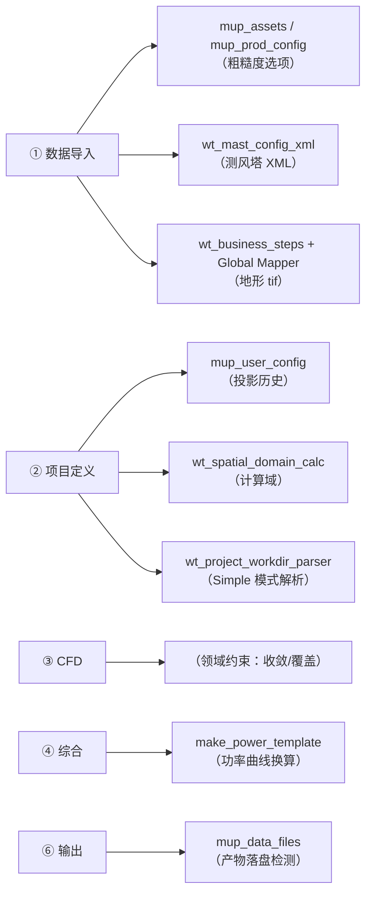

# C7 · MUP 领域工具集

> 本篇回答：**那些 `mup_*.py` 与领域专用模块各自干什么、为什么要有它们**。
> 读者：写 MUP 相关步骤的人、要新增领域能力的人。
>
> 业务原理在卷 B6；本篇讲**代码化的领域能力**。

---

## 1. 为什么需要这一族

自动化的两类脆弱点：

1. **选项类控件的取值随安装数据变化**（粗糙度索引文件、投影列表）→ 硬编码必错；
2. **流程的输入/产物散落在文件系统中**（地形 tif、测风塔 tim、机位点 wtg、MUP 用户数据目录）→ 需要程序化探测与校验。

这一族模块把"读真值"和"算领域量"从流程定义里剥离出来，变成可测的纯函数。

---

## 2. 读 MUP 的权威数据

### 2.1 `mup_assets.py`（291 行）· 安装目录资产

**要解决的问题**：MUP 的"粗糙度索引文件"下拉框选项来自

```
<MUP安装目录>/Assets/CorrespondanceFiles/*.txt   （如 ESA2020.txt）
```

不同安装、不同版本，这个文件集合不同。**硬编码选项列表一定会在某台机器上失效**。

**做法**：读取 MUP 安装目录资产，为自动化提供**权威选项数据与校验**。

### 2.2 `mup_prod_config.py`（197 行）· 软件行为参数库

解析 MUP 安装目录的 **`PROD_default_parameters.ini`**。

| 能力 | 说明 |
|---|---|
| `roughness_pairs()` | 官方"粗糙度源 ↔ 索引文件"映射，**实测 8 组，含 `Config_5` 并列** |

价值：把官方配置变成可查询的结构化数据，避免流程里写死对应关系。

### 2.3 `mup_user_config.py`（149 行）· 用户配置与投影历史

读取 MUP 的 `user.config`，**提取投影历史**供"设置投影"步骤使用。

| 项 | 说明 |
|---|---|
| 路径 | `%LOCALAPPDATA%\Meteodyn\MUPSmartClient.exe_Url_*\*\*\user.config` |
| 难点 | 路径中的 **exe 哈希 / 版本号随安装变化** → 必须用 glob 匹配 |
| 运行时消费 | `wt_flow_executor` 在 L1799 处**延迟 import** `resolve_projection` / `clear_projection_cache` |

### 2.4 `mup_data_files.py`（157 行）· 产物落盘检测

读取 MUP 用户数据目录（`C:\ProgramData\Meteodyn\MUP`），**提供流程产物落盘检测**。

例：导入地形后应产生

```
OROGRAPHY/<project>_<zone>.tif
```

用途：判断"这一步到底有没有真的产出"，是**防假成功**的领域侧手段（与卷 B5 的 `continueWhen` 互补）。

---

## 3. 领域计算与文件生成

### 3.1 `wt_mast_config_xml.py`（223 行）· 测风塔配置 XML

**设计**：固定模板**注入式**（2026-09-04 定稿）——不改模板结构，只把列映射与参数注入。

| 函数 | 行号 | 作用 |
|---|---|---|
| `probe_tim_column_headers(tim_path)` | L96 | 探查 `.tim` 列头（决定列映射，不同数据商格式不同） |
| `build_mast_config_xml(tim_path, mast_name, hub_height, output_dir=None, ...)` | L124 | 生成 XML |
| `save_mast_config_xml(...)` | L171 | 保存 |
| `main(argv=None)` | L196 | CLI |

### 3.2 `wt_spatial_domain_calc.py`（444 行）· 空间计算域

| 成员 | 行号 | 作用 |
|---|---|---|
| `SpatialPoint` | L24 | 空间点 |
| `parse_coordinate_file(file_path, category=None)` | L46 | 解析坐标文件 |
| `parse_points_from_input_dir(dir_path)` | L81 | 批量解析 |
| `calculate_spatial_domain(...)` | L102 | **计算计算域** |
| `inject_into_flow_definitions(...)` | L194 | 注入流程定义 |
| `build_spatial_text_overrides(...)` | L288 | 构造文本覆盖 |
| `format_calculation_report(calc_result)` | L352 | 可读报告 |
| `main()` | L398 | CLI |

**域约束**：WT 只在边长 `1.2×2×R` 的正方形内计算，地形须覆盖到 `1.2×√2×R + 2000 m`（B6 §3②）。

### 3.3 `wt_project_workdir_parser.py`（1 138 行）· 项目工作目录解析

用于 **Simple 模式自动解析键入值**。纯函数、无 GUI。

| 公开入口 | 行号 | 作用 |
|---|---|---|
| `parse_project_work_dir(work_dir, project_params=None, flow_path=None)` | L676 | 主解析 |
| `summarize_project_work_dir(work_dir, project_params=None)` | L715 | 摘要 |
| `list_mast_entries(work_dir)` | L705 | 测风塔条目 |
| `diagnose_project_work_dir(work_dir)` | L813 | 诊断 |
| `parse_all_masts(work_dir, project_params=None, flow_path=None)` | L862 | 全塔解析 |
| `build_text_overrides(flow_path, runtime_config, base_overrides=None)` | L928 | 文本覆盖 |
| `apply_overrides_to_payload(payload, text_overrides=None, path_prefix_overrides=None)` | L1066 | 应用覆盖 |
| `load_project_params_from_work_dir(work_dir)` | L1125 | 项目参数 |

**识别能力**（内部）：地形/坐标/测风数据/风机文件判别（`_is_terrain` / `_is_coords` / `_is_mastdata` / `_is_turbine`）、UTM 合理性（`_is_plausible_utm`）、CFT 信息解析（`_parse_cft_info_file`）、`.tim` 头解析（`_parse_tim_header`）、WTG 高度与文件名解析（`_parse_wtg_height` / `_parse_wtg_filename` / `_parse_wtg_meta`）、测风塔 ID 收集（`_collect_mast_ids`）。

> 📌 它与 `wt_spatial_domain_calc` 一起，把"从一堆甲方文件里认出哪个是地形、哪个是测风塔"这件事自动化了。

### 3.4 `make_power_template.py`（262 行）· 功率计算模板

生成「10 min 时序风速 → 逐时功率」Excel 计算模板。

**物理模型**：空气密度修正，**IEC 常用等效风速法**。

---

## 4. 地形预处理子链

| 载体 | 说明 |
|---|---|
| `wt_business_steps.py`（341 行） | `step_launch_gm` → `step_open_source_dwg` → `step_split_layers` → `step_create_grid` → `step_export_geotiff` 等 12 个分步（详见 C1 §6） |
| `wait_global_mapper_ready.py`（179 行） | 等待 Global Mapper 就绪 |
| `fix_server_gm_exe.py`（53 行） | 服务器端把 `${GM_EXE}` 从 `.lnk` 改为直接可执行 `.exe`——背景：用 `.lnk` 启动存在可靠性与 **UIPI** 差异问题 |

**这条子链说明一个问题**：MUP 的地形导入依赖外部 GIS 工具（Global Mapper），因此自动化链路要延伸到 MUP 之外。

---

## 5. 接口探查探针族（`tools/research/`，28 个脚本）

这类脚本**不是产品代码**，而是"当年我们怎么确认 MUP 没有可用接口"的证据。保留它们是为了防止重复探索。

| 类别 | 脚本 |
|---|---|
| REST / API 探查 | `mup_mup_api_probe.py`、`mup_rest_probe*.py`（1–8）、`mup_mup_rest.py` |
| 目录与结构 | `mup_prod_struct.py`、`mup_data_dir.py`、`mup_data2.py`、`mup_deep.py`、`mup_deep_survey.py`、`mup_asset_survey.py` |
| 日志 | `mup_logs_check.py`、`mup_log_0807.py`、`mup_log_0810.py` |
| 窗口与授权 | `mup_enum_windows.py`、`mup_bin_license.py`、`mup_mup_config.py` |
| 回归校验 | `mup_regression_check.py`、`mup_regression_check2.py`、`mup_topo_check.py` |

> 📌 结论与路线选择见 **B6 §5**：最终确定走外部 RPA。

---

## 6. 与业务阶段的对应关系



---

## 7. 使用纪律

| # | 纪律 |
|---|---|
| 1 | **选项类控件不要硬编码**，一律走 `mup_assets` / `mup_prod_config` 读真值 |
| 2 | MUP 路径含哈希/版本号的，用 **glob** 匹配（`mup_user_config` 的做法） |
| 3 | 领域计算优先做成**纯函数**（如 `wt_spatial_domain_calc`），便于单测 |
| 4 | 新增"读 MUP 数据"能力时，放这一族而不是塞进执行器 |
| 5 | 判断"这步有没有真的产出"优先用 `mup_data_files` 的落盘检测，而不是只看 UI 状态 |
| 6 | `tools/research/` 的探针是**历史资料**，不要当作可复用的产品代码 |

---

核验：2026-09-11 / 涉及：`mup_assets.py`、`mup_prod_config.py`、`mup_user_config.py`、`mup_data_files.py`、`wt_mast_config_xml.py`、`wt_spatial_domain_calc.py`、`wt_project_workdir_parser.py`、`make_power_template.py`、`wt_business_steps.py`、`wait_global_mapper_ready.py`、`fix_server_gm_exe.py`、`tools/research/`（28 个探针）、`tests/test_spatial_domain_calc.py`
