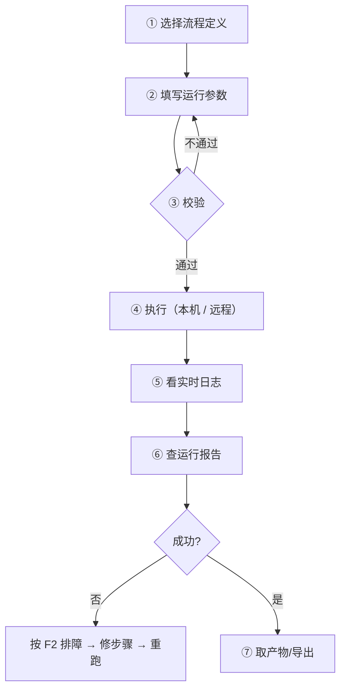

# D2 · 总控台使用手册（`WT_Launcher`）

> 本篇回答：**总控台怎么用来完成一次完整的自动化作业**。
> 读者：所有使用者。
>
> 模块内部机制在 C2 §2；本篇是**操作手册**。

---

## 1. 启动方式

| 脚本 | 环境 | 说明 |
|---|---|---|
| `启动WT自动化总控台.bat` | 开发机 | 管理员提升 + `pythonw` 无控制台 |
| `启动WT自动化总控台_无窗口.bat` | 开发机 | 与上者**逐字节相同、互为别名** |
| `启动WT自动化总控台_内网.bat` | 内网机 | 走便携 Python |
| `启动WT自动化总控台_内网_无窗口.bat` | 内网机 | 同上，互为别名 |
| `调试启动_显示错误.bat` | 两端 | **带控制台**，排障时用（能看到完整报错） |

> 💡 出问题时的第一反应应该是：**换成 `调试启动_显示错误.bat` 启动**，无窗口模式会把报错吞掉。

**提权**：入口做管理员提升，程序内还有一套检测与重新提权（`_should_relaunch_elevated` / `_relaunch_elevated` 等）。原因见 B1 §7（UIPI）。

---

## 2. 界面组成

总控台是**集成式工作台**，主要区域：

| 区域 | 作用 | 相关模块 |
|---|---|---|
| 流程选择 | 选择/切换当前流程定义 | `load_effective_flow_payload`（L339） |
| 运行参数 | 配置 `runtimeConfig`（如 `sourceFilePath`、`outputDir`） | `load_flow_runtime_config`（L203） |
| 执行控制 | 启动 / 停止、实时日志 | `WT_AUT_recorded` 子进程 |
| **流程链路图** | 只读可视化流程卡片，点节点看步骤详情 | `wt_flow_graph.FlowGraphWindow` |
| 队列窗口 | 任务投递、状态、日志尾部 | `wt_task_queue_window`（C5 §6） |
| 服务器监控 | 只读拉取远端监控端点 | `ServerMonitorWindow`（L1611） |
| Simple 模式 | 按场景（地形/气象/元素/机型/项目/CFD/综合）快捷入口 | `simpleModeFlows` / `simpleModeEnabled` |
| UI-TARS / VLM 配置 | 模型、API Key、仓库路径、AI 介入开关 | L4957–4958、L5989–5997 |
| 界面缩放 | 100%~200% / 自动，所有 tkinter 窗口共用 | `wt_dpi`（B1 §5） |

> 📷 **本手册不插图**，原因见文末 §9。下面用"界面速览"代替——按分区说明**你会在屏幕上看到什么、怎么认出它**。

### 界面速览（`LauncherApp`）

窗口自上而下的典型分区：

| 位置 | 区块 | 怎么认出它 | 主要控件 |
|---|---|---|---|
| **顶部** | 模式工具条 | 两枚大按钮/胶囊：**Simple** 与 **Advanced**（`uiMode` 控制） | 模式切换；Simple 模式下是双层工具栏 |
| **左侧 / 上部** | 流程选择 | 当前流程名（如 `flow_definition_发送综合计算.json`）+ 切换入口 | 下拉/列表、浏览按钮 |
| **中部** | 运行参数 | 一组"标签 + 输入框"：`sourceFilePath` / `outputDir` / `projectionFilePath` / `gmExe` | 文本输入框、浏览按钮 |
| **中部** | 执行控制 | 开始 / 停止按钮 + **实时日志**滚动区 | 按钮、日志文本框 |
| **中部（可切换）** | 流程链路图 | **纵向流程卡片**序列，点节点弹该步详情 | Canvas 自绘卡片（`FlowGraphWindow`） |
| **下部 / 标签页** | Advanced 三 Tab 抽屉 | 高级功能分三个标签收纳 | 分页容器 |
| **下部 / 标签页** | 队列窗口 | 任务表格：ID / 状态 / 进度 / 提交者；下方可看日志尾 | 表格、日志尾区 |
| **下部 / 标签页** | 服务器监控 | 远端队列状态（只读） | 状态卡片 |
| **设置区** | UI-TARS / VLM 配置 | 模型、API Key、仓库路径、**AI 介入开关** | 输入框、复选框 |
| **设置区** | 界面缩放 | 自动 / 100% / 125% / 150% / 175% / 200% | 下拉或药丸选择器 |

**Simple 模式**：按场景（地形 / 气象 / 元素 / 机型 / 项目 / CFD / 综合）给大号入口卡片，选中板块会显示**高亮边框与指示条**。

> 💡 找不到某个区块时：①看 `uiMode` 是不是在 Simple 模式（Advanced 功能被收起）；②Advanced 的三 Tab 抽屉里翻一翻；③窗口太窄会导致部分面板被折叠——拉宽窗口。

---

## 3. 典型作业流程

### 3.1 选择流程

- 从列表或 Simple 模式入口选；
- 保存时会同步到 `launcher_state.json` 的 `flowDefinitionPath`；
- "有效 payload"= 目标流程 ⊕ 注册表（`_merge_target_with_registry`），所以**注册表里的包也能被选到**。

### 3.2 填写运行参数

`runtimeConfig` 的常见键（详见 E4 §3）：

| 键 | 说明 |
|---|---|
| `sourceFilePath` | 源文件路径（DWG / 地形） |
| `outputDir` | 输出目录 |
| `projectionFilePath` | 投影文件 |
| `gmExe` | Global Mapper 路径 |

也支持 **Simple 模式自动解析**：指定 `项目工作目录` 后由 `wt_project_workdir_parser` 自动识别并填充（C7 §3.3）。

### 3.3 校验

- 保存/执行前会走 `validate_effective_flow_payload`；
- 导入流程走更强的 `validate_imported_flow_payload_or_raise`；
- 常见报错与含义见 E2 §6。

### 3.4 执行

| 方式 | 说明 |
|---|---|
| 本机执行 | 直接拉起 `WT_AUT_recorded.py` 子进程 |
| 远程执行 | 通过队列窗口投递到服务机（D6） |

### 3.5 查看结果

**第一站永远是 `logs/last_run_report.json`**（F1）。它同时给出"失败在哪一步、走了几级降级、耗时多少"。

---

## 4. 队列与远程

| 操作 | 位置 |
|---|---|
| 投递任务 | 队列窗口（D6） |
| 看任务状态/日志尾 | 队列窗口 |
| 看服务器状态 | 服务器监控窗口（只读，端口默认 8767） |
| 连通性检查 | `check_queue_link.bat` / `wt_queue_selfcheck.py --check <IP>` |

地址与令牌配置在 `launcher_state.json`：`taskQueueUrl`、`serverMonitorUrl`、`taskQueueUser`、`taskQueueToken`。

> 🚨 `launcher_state.json` **含 API Key 与令牌，已 gitignore、从未入库**（E4 §6.1）；换了机器要人工携带，不要提交。

---

## 5. AI 介入开关

- 开关：`enableAiIntervention`；
- 语义（界面原文）：**"仅在普通执行和模板兜底都失败后调用 UI-TARS"**；
- 透传给子进程的环境变量：`WT_ENABLE_AI_INTERVENTION`、`UI_TARS_*`、`WT_AI_INTERVENTION_LOG_LINES=10`；
- **内网通常不可用**（需 Node.js + 外网 VLM 服务）。

---

## 6. 状态与配置

| 文件 | 内容 |
|---|---|
| `launcher_state.json` | 模型/端点/API Key、UI-TARS 路径、当前流程、Simple 模式开关、项目工作目录、队列地址、`uiMode`、`updatedAt` |
| `workspace/ui_scale.json` | 界面缩放档位，**所有 tkinter 窗口共用** |
| `logs/run_status.json` | 运行状态（供轮询） |
| `logs/last_run_report.json` | 最近一次运行报告 |

完整键表见 E4 §4.1。

---

## 7. 常见操作问题

| 问题 | 处理 |
|---|---|
| 启动后一闪而过 | 用 `调试启动_显示错误.bat`；查 `logs/launcher_headless.log` |
| 界面模糊或过小 | 调"界面缩放"档位（默认首次 150%） |
| 找不到刚写的流程 | 检查是否保存（保存时 `sync_flow_package_registry` 才同步进注册表） |
| 参数填了不生效 | 检查是否被更高优先级覆盖：任务携带参数 > 环境变量 > `launcher_state.json` > 流程 `runtimeConfig`（E4 §1） |
| 提示权限/输入无效 | 目标程序是否管理员运行 → 需要同样提权（B1 §7） |
| 步骤全成功但仍报"执行失败" | 多为**收尾阶段的原生崩溃**（Tk 跨线程 / COM 跨公寓），见 F2 |

---

## 8. 相关文档

| 想做什么 | 去哪 |
|---|---|
| 编辑流程 | D3 |
| 采集控件 | D4 |
| Excel / 录制 | D5 |
| 远程与批量 | D6 |
| AI 助手 | D7 |
| 一条完整作业怎么串 | D8 |
| 出故障 | F2 |

---

## 9. 关于插图

本手册（及整套技术文档）**不使用界面截图**，改用文字化的"界面速览"。原因：

| # | 理由 |
|---|---|
| 1 | `AGENTS.md` 禁止事项：**"禁止提交体积大的生成产物（截图、录像、构建产物）"** |
| 2 | 2026-09 刚完成一轮 UI 商业化改造（设计令牌统一 + 排版重构），**截图会迅速过期**，文字描述可 diff、可随代码同步修改 |
| 3 | 截图无法被搜索、无法被 AI/Agent 消费；文字描述可以直接进 Agent 的知识检索 |

**如果你确实需要图**（例如给汇报材料用）：自己截了放本地即可，**不要提交**；或放进发布包/外部知识库，文档里用文件名引用。

---

核验：2026-09-11 / 涉及：`WT_Launcher.py`(L130, L203–407, L1611, L1833, L4957–4958, L5989–5997, L9055–9168)、`wt_flow_graph.py`、`wt_task_queue_window.py`、`wt_dpi.py`
