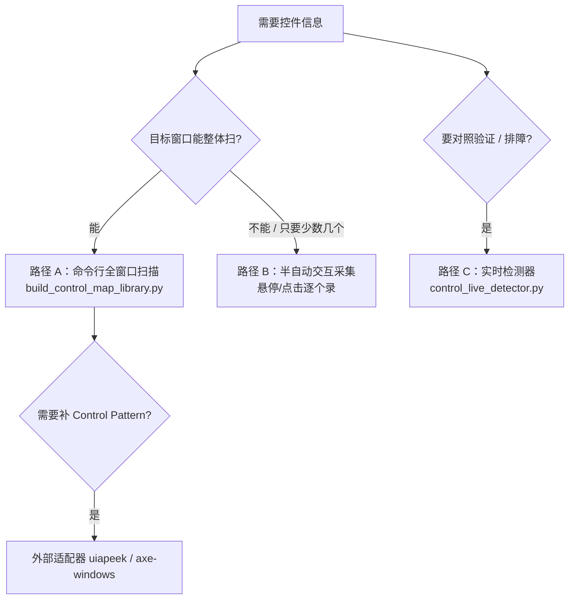
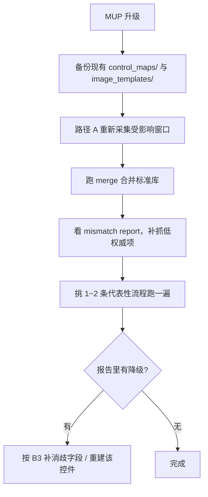

# D4 · 控件采集与资产维护手册

> 本篇回答：**什么时候要采集、三条采集路径怎么选、采完怎么合并、版本升级后怎么重建**。
> 读者：控件库维护者。
>
> 采集器内部机制在 C3，数据格式在 E3；本篇是**操作手册**。

---

## 1. 什么时候必须采集

| 触发 | 说明 |
|---|---|
| **MUP 版本升级** | 控件属性/父链变化，旧库可能大面积失配 |
| 新增流程板块 | 新对话框的控件从未入库 |
| 步骤长期靠 L3/L4 兜底 | 报告里 `fallbackUsed` / `fallbackTemplateUsed` 频现 = 定位退化（B5 §8） |
| 出现"点了别的控件" | 需要补消歧字段（`label_text` / `ui_path`） |
| 换机器/换分辨率 | 建议抽查 |

---

## 2. 三条路径怎么选



| 路径 | 载体 | 适用 |
|---|---|---|
| **A** | `build_control_map_library.py` | **主力**：整窗批量采集 |
| **B** | 采集器的交互模式（`pynput` → 缺失降级 `win32_input_hook`） | 只要少数控件、或整窗扫不动 |
| **C** | `control_live_detector.py` | 开发/排障：**悬停即匹配** |
| 补充 | `tools/external_capture/` | 补 Control Pattern（Invoke/Value/Toggle/Selection） |

---

## 3. 路径 A：命令行全窗口扫描

```powershell
python build_control_map_library.py "窗口标题关键字" [选项]
```

| 参数 | 说明 |
|---|---|
| `window_title`（位置参数） | 目标窗口**标题关键字** |
| `--foreground` | 扫描**当前前台窗口**（不想/不能写标题时用） |
| `--backend` | pywinauto backend，默认 `uia` |
| `--max-depth` | 递归扫描最大深度 |
| `--output` | 输出 JSON 路径（默认落 `control_maps/`） |

**操作要点**

1. 先让目标窗口处于**可见、非最小化**状态；
2. 用标题关键字定位（或 `--foreground` 直接扫前台）；
3. 采集过程有进度浮层（`_ScanProgressOverlay`）与任务栏进度，结束有提示音；
4. 产出写入 `control_maps/`（⚠️ **落在根目录**，见 §6）；
5. 采集器会自动：过滤无价值容器、清洗超长/SVG name、为每个控件生成**定位推荐**（`build_locator_recommendation`）。

---

## 4. 路径 B：半自动交互采集

无法整窗扫描或只要少数控件时使用。依赖：

| 依赖 | 说明 |
|---|---|
| `pynput` | 首选（全局鼠标/键盘监听） |
| `win32_input_hook.py` | **缺失时自动降级**：纯 `ctypes` 低级钩子，监听全局左键按下与 **F8** 热键 |

交互反馈：`_hover_log`（悬停日志）、`_play_notify_sound`（提示音）、`_paint_button`（按钮着色）。

---

## 5. 路径 C 与补充适配器

### 5.1 实时检测器

`control_live_detector.py`：鼠标悬停即捕获控件信息并**与控件库实时匹配**。用于"这个控件在库里到底长什么样/匹不匹配"的快速验证。

> ⚠️ 该文件被 `.gitignore` 忽略，新 worktree 需从主目录拷贝（D1 §6）。

### 5.2 外部采集适配器（可选补充）

```powershell
python tools/external_capture/capture.py {uiapeek|axewindows} ...
```

| 适配器 | 协议 | 说明 |
|---|---|---|
| uia-peek | HTTP **`:9955`**（本地 UiaPeek 服务） | 按坐标/焦点 peek 祖先链；可录制键鼠事件流 |
| axe-windows | CLI（`AxeWindowsCLI.exe`）+ C# bridge | 补 **Control Pattern**；管理员目标需提权采集 |

> ⚠️ **关键事实**：Axe.Windows 的 Scan API **只返回触发无障碍规则的元素子集**，不是整棵树。它**不能替代**路径 A 的全量采集，只能补 Pattern。

---

## 6. ⚠️ 采集落盘与合并的已知断点（P1）

| 环节 | 路径 |
|---|---|
| 采集落盘 | `control_maps/` **根目录** |
| 标准库合并读取（`load_all`） | 只 glob **`recordings/*_control_map.json`** 与 **`library/library_*.json`** |

**后果**：新采集的库不会自动进入标准库合并。

**当前的两种绕法**（任选其一，均需人工）：

1. 把新采集文件手动移入 `recordings/` 或按 `library/library_*.json` 重命名后放入 `library/`；
2. 直接改 `load_all` 为 `os.walk` 递归（代码级修复，待排期）。

> 💡 **不受影响的部分**：流程**转换匹配**用 `os.walk` 递归（`flow_recorder_converter._load_control_map_definitions`），能读到根目录与所有子目录。所以"采集完立刻做录制转换"是正常工作流。

---

## 7. 合并入标准库

```powershell
python tools/merge_standard_control_library.py
```

主要函数 `run_merge(input_dir, catalog_out, report_out, ...)`（L589）。

**产出**

| 产物 | 内容 |
|---|---|
| `control_maps/standard/standard_control_catalog.json` | 标准控件目录（按 `authority` 分级） |
| `standard_catalog_mismatch_report.json` | **"对不上"的低权威项**（如 `frameworkId=unknown`、窗口标题为空） |
| `总控件信息.json` | master payload |

**建议**：每次采集后都跑一次合并，并**看一眼 mismatch report**，把低权威项补抓。

---

## 8. 图像模板的采集与更新

| 方式 | 说明 |
|---|---|
| 模板采集器 | `build_image_template_library.py`（截图 + OCR 命名），维护子目录 `templates_index.json` |
| **执行中自动采集** | 步骤执行成功/模板兜底失败时 best-effort 截图 → `image_templates/auto_captured/<窗口>/<控件名>.png` |
| 生成期自动关联 | `image_template_index.auto_associate_fallback_templates(steps)` 批量补 `fallbackTemplate`（**非破坏性**，不覆盖已有配置） |
| 自动更新开关 | `templateAutoUpdate`（`launcher_state.json`） |

> 🛡️ **自动更新的安全阀**：`images_are_similar()` 用**感知哈希**（32×32 → DCT 8×8 → 汉明距离 ≤ 8）+ 灰度均值差 > 20 守卫判定。
> **宁可不更新，也不可把"假成功/界面波动时的错误截图"盖掉可用模板**（B4 §3.4）。

---

## 9. 版本升级后的重建流程



| # | 检查 |
|---|---|
| 1 | 关键步骤是否仍走 **L1**（复合精确定位），而不是 L3/L4 |
| 2 | `logs/last_run_report.json` 里 `fallbackUsed` / `fallbackTemplateUsed` 是否消失 |
| 3 | 同名控件的消歧字段是否仍有效（面板标题、label） |

---

## 10. 维护纪律

| # | 纪律 |
|---|---|
| 1 | 新增字段必须**三路采集器 + merge 工具**同步，否则合并时静默丢字段（E3 §6） |
| 2 | 改消歧逻辑要同时改：采集端 / canonical 合并 / **对话框去重**（C3 §7 的 InterestAreas 教训） |
| 3 | 新增模板后确认 `templates_index.json` 已更新 |
| 4 | 目标程序管理员运行时，采集器也要提权 |
| 5 | 升级后**必须**重新采集 + 回归，不要指望旧库跨大版本可用 |

---

核验：2026-09-11 / 涉及：`build_control_map_library.py`(argparse + L378–534 + `_save_control_map_payload`)、`control_live_detector.py`、`win32_input_hook.py`、`tools/external_capture/`、`tools/merge_standard_control_library.py`(L49, L589)、`build_image_template_library.py`、`image_template_index.py`
