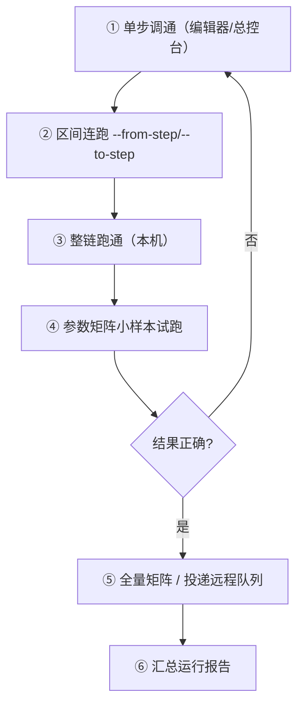

# D6 · 远程任务执行与参数矩阵扫描

> 本篇回答：**怎么把任务投到无人值守机上跑**，以及**怎么一次跑几十上百个参数组合**。
> 读者：运维、做多方案比选的人。
>
> 队列组件在 C5，接口协议在 E5；本篇是**操作手册**。

---

## 1. 两条批量路径

| 路径 | 载体 | 适用 |
|---|---|---|
| **参数矩阵扫描** | `param_table_*.json|xlsx` + `ParameterScanner` | 本机/脚本批量，同一流程跑多组参数 |
| **远程任务队列** | `wt_task_server` + `wt_task_queue` | 内网机无人值守，可跨机器投递 |

两者可叠加：参数矩阵展开出的每一组，作为**一个任务**投递。

---

## 2. 远程执行：服务端

### 2.1 启动服务

```powershell
python wt_task_server.py --auth-token <令牌> [选项]
```

| 参数 | 说明 |
|---|---|
| `--host` | 监听地址，默认 `0.0.0.0` |
| `--port` | 监听端口 |
| `--auth-token` | **必填**，共享 Bearer token |
| `--db` | 队列 SQLite 路径，默认 `logs/task_queue.db` |
| `--webhook` | 任务终态事件的全局回调 URL |
| `--log-retention-days` | 任务日志保留天数 |

也可用 `start_queue_service.bat`。

### 2.2 一键自检

```powershell
# 服务器端：启动并自检
python wt_queue_selfcheck.py --server [--token 令牌]

# 客户端：检测连通性
python wt_queue_selfcheck.py --check <服务器IP> [--token 令牌]

# 停止本机 8768/8767 上的服务进程
python wt_queue_selfcheck.py --stop
```

其它参数：`--token`、`--force`。

### 2.3 端口

| 服务 | 默认端口 |
|---|---:|
| 队列服务 | **8768** |
| 监控服务（`wt_server_monitor`） | **8767** |

> 实际以 `launcher_state.json` 的 `taskQueueUrl` / `serverMonitorUrl` 为准。

### 2.4 前置条件（不满足必失败）

| 条件 | 诊断 |
|---|---|
| worker 与 MUP **同 Windows 会话** | `diagnose_session.py` |
| 可交互桌面（非锁屏/非服务会话） | `wt_task_queue.check_desktop_interactive()` |
| 提权一致（UIPI） | 目标程序管理员运行时 worker 也需提权 |
| 服务常驻 | `start_queue_service.bat` |

---

## 3. 远程执行：客户端

### 3.1 图形界面

总控台 → 队列窗口（`wt_task_queue_window`）：投递、看状态、看日志尾、暂停/终止。

### 3.2 提交任务（关键字段）

| 字段 | 说明 |
|---|---|
| `flowPath` | **流程定义路径**——远程一致性关键 |
| `steps` | 指定步骤；空 = 全跑 |
| `fromStep` / `toStep` | 步骤区间 |
| `priority` | 优先级 |
| `scheduledAt` | 定时投递 |
| `maxAttempts` / `retryDelaySeconds` | 重试策略 |
| `timeoutSeconds` | 超时 |
| `notifyUrl` | 完成回调 |
| `runtimeConfig` | 运行时参数（覆盖流程内默认值） |
| **`idempotencyKey`** | **幂等键**：相同 `(user, key)` 重复提交直接返回已有任务（标记 `idempotentReplay`） |

端点：`POST /api/tasks/submit`、`POST /api/tasks/batch-submit`（详见 E5 §2）。

> 🚨 **远程一致性的硬纪律**：worker 以**任务携带的 flowPath 与参数**为准，不能读本机默认。否则"投递 A 流程、跑起来是 B 流程"（C5 §3.2）。

---

## 4. 参数矩阵扫描

### 4.1 参数表是什么

`flow_packages/param_table_<板块>.json` 是一个 **JSON 数组**，每行一组参数。实测 `param_table_发送综合计算.json` 有 4 行，行内字段例如：

```json
{
  "stepMode": "create",
  "synthesisName": "综合1",
  "wohler": "1",
  "towerMode": "multi",
  "mettowername": "M1",
  "refMast": "M1",
  "refClimatology": "M1",
  "defaultTurbine": "WT6250D220",
  "weatherName": "M1",
  "cpVersion": "Cp0.429",
  "drawLayout": "不带绘图",
  "refMast2": "Mast1",
  "refClimatology2": "Mast1"
}
```

**双模**：同名同时提供 `.json`（程序用）与 `.xlsx`（人工编辑）。

### 4.2 `ParameterScanner` 的能力

`WT_AUTOMATION_Agent/parameter_scan.py` **没有命令行入口**，它作为库被 GUI / Agent 调用：

| 方法 | 行号 | 作用 |
|---|---|---|
| `read_excel(...)` | L108 | 读 Excel 参数表 |
| `read_csv(...)` | L179 | 读 CSV |
| `read_json(file_path, max_rows=0)` | L225 | 读 JSON |
| `read_auto(...)` | L269 | 按扩展名自动分派 |
| `scan(...)` | L292 | 扫描主入口 |
| `scan_from_flow(...)` | L510 | **从流程定义反推**可扫描参数 |
| `analyze_step_excel(...)` | L560 | 分析步骤与 Excel 列的关系 |
| `suggest_param_columns(...)` | L641 | 建议参数列 |
| `export_param_template(...)` | L651 | **导出参数表模板** |
| `auto_scan_from_steps(...)` | L760 | 从步骤自动扫描 |
| `to_step_params()` | L52 | `ParameterRow` → `stepParams` 字典 |

> 💡 **最快上手**：用 `export_param_template` 导出模板 → 填表 → 跑扫描。不要手搓表头。

### 4.3 运行时展开

`WT_AUT_recorded._apply_param_table_expansion(merged_payload, target_payload)`（L738）把参数表展开为**多轮执行**，每轮用 `${stepParams.<列名>}` 注入。

---

## 5. 执行入口的命令行开关

`WT_AUT_recorded.py`（也是 worker 入口）：

| 参数 | 说明 |
|---|---|
| `--steps` | 指定步骤列表 |
| `--from-step` / `--to-step` | **步骤区间** |
| `--skip-setup` | 跳过初始化步骤 |
| `--no-monitor` | 不显示监视窗口 |
| `--task-id` / `--task-user` / `--task-db` | 任务上下文（队列 worker 用） |
| `--no-pre-raise` | 关闭前置抛出 |

**环境变量**

| 变量 | 说明 |
|---|---|
| `WT_FLOW_DEFINITION_FILE` | 指定本次运行的流程定义文件 |
| `GM_RUNTIME_CONFIG_JSON` | 以 JSON 串注入运行时参数（Simple 界面解析结果） |

**真实示例**（`run_scan3.bat`）：

```bat
set WT_FLOW_DEFINITION_FILE=<仓库根>\flow_packages\flow_definition_发送综合计算.json
python WT_AUT_recorded.py --from-step step_1_scan3_41 --to-step step_copy_goback_scan3_51 --skip-setup
```

> 💡 这个组合（指定流程 + 步骤区间 + 跳过 setup）是**分段验证**的标准做法：先单步调通，再区间连跑，最后整链跑。

---

## 6. 推荐作业节奏



| # | 检查 |
|---|---|
| 1 | 单步阶段就确认**没有走降级**（报告里无 `fallbackUsed`） |
| 2 | 小样本试跑确认参数注入正确（`${stepParams.x}` 展开对了） |
| 3 | 远程场景确认 worker 消费的是**任务携带的 flowPath** |
| 4 | 全量跑完后扫一遍 `fallbackUsed` / `fallbackTemplateUsed`，有则说明定位在退化（B5 §8） |

---

## 7. 常见问题

| 症状 | 排查 |
|---|---|
| 任务一直 `pending` | 服务是否在跑；`--check <IP>` 查连通；worker 能否拉起 |
| 任务卡在 `running` | worker 崩了 → `recover_orphan_running_tasks`（默认 120 s 后回收）；查 `diagnose_session.py` |
| 跑的流程不是我投的 | worker 读了本机默认 → 检查任务是否携带 `flowPath`（C5 §3.2） |
| 参数没注入 | 占位符写法（`${stepParams.x}`）；空值会**保留字面量**（E4 §2.2） |
| 批量重复排队 | 提交时带 `idempotencyKey` |
| 看不到 MUP 窗口 | 会话/权限问题（C5 §7） |

---

## 8. 相关文档

| 想做什么 | 去哪 |
|---|---|
| 队列组件原理 | C5 |
| HTTP 接口字段 | E5 |
| 占位符语法 | E4 |
| 报告与排障 | F1 / F2 |

---

核验：2026-09-11 / 涉及：`wt_task_server.py`(argparse L1932+)、`wt_queue_selfcheck.py`(L33–223)、`WT_AUTOMATION_Agent/parameter_scan.py`(L52–760)、`WT_AUT_recorded.py`(L738, L2723–2731, L76–83)、`flow_packages/param_table_发送综合计算.json`、`run_scan3.bat`
