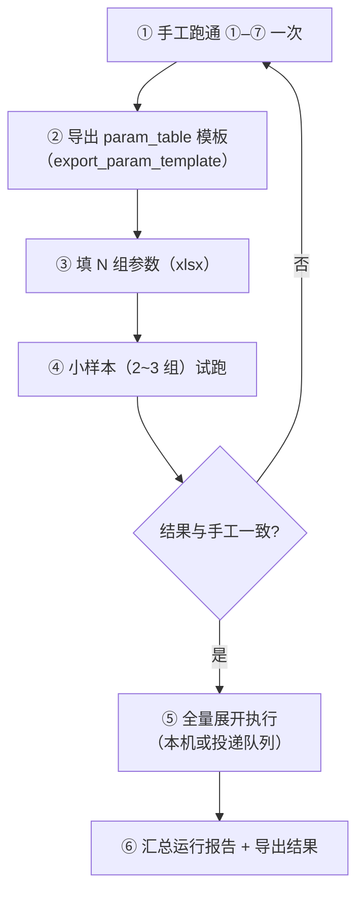

# D8 · 端到端作业 SOP 与典型案例

> 本篇回答：**一条完整的风资源评估作业，怎么从头跑到尾**。
> 读者：所有人。**这是卷 D 的"会用"篇**。
>
> 领域约束在 B6，单模块操作在 D1–D7；本篇讲**串联与验收**。

---

## 0. 通用前提检查表（每次开跑前）

| # | 检查项 | 不满足的后果 |
|---|---|---|
| 1 | 控件库是**当前 MUP 版本**采集的 | 大面积定位失败（D4） |
| 2 | `runtimeConfig` 已填（`sourceFilePath` / `outputDir` …） | 占位符展开为空 |
| 3 | 投影已确定且与数据一致 | **CFD 与可视化失效**（B6 §3①） |
| 4 | 地形覆盖满足 `1.2×√2×R + 2000 m` | 计算域边缘无数据（B6 §3②） |
| 5 | 目标窗口可见、非最小化、未锁屏 | UIA 树拿不到 |
| 6 | 自动化进程与 MUP **同会话且权限匹配** | 看不到窗口 / 输入无效 |
| 7 | 流程保存时校验通过 | 执行中断 |

---

## 1. 作业主线总览


| 阶段 | 流程定义文件 |
|---|---|
| ① 项目定义 | `flow_definition_创建一个新建模.json`、`flow_definition_microscale_create_model.json` |
| ② 地形 | `flow_definition_导入地形图.json`、`flow_definition_geo_import_data_file.json` |
| ③ 元素 | `flow_definition_导入并配置元素.json` |
| ④ 测风塔/机位点 | `flow_definition_导入测风塔、机位点.json` |
| ⑤ CFD | `flow_definition_发送CFD计算.json` |
| ⑥ 综合 | `flow_definition_发送综合计算.json`（配套 `param_table_发送综合计算.json|xlsx`） |
| ⑦ 导出 | `flow_definition_导出综合计算结果.json` |
| 气象数据 | `flow_definition_新建气象数据_内网.json` / `_外网.json` / `_配置导入.json` |
| 风机类型 | `flow_definition_新建风机类型.json`、`flow_definition_turbine_type_create_and_curves.json` |

---

## 2. SOP ① 创建一个新建模

| 项 | 内容 |
|---|---|
| 前置 | MUP 已启动并处于主界面 |
| 关键步骤 | 进入微尺度模块 → 新建建模 → 设置**投影**、位置、项目半径 R |
| 常见卡点 | 投影选择对话框是 WPF 组合框 → 常用 `select_dropdown_item_runtime` 或 `click_relative_anchor`(right) |
| 验收 | 项目出现在项目树；投影信息正确（可查 `mup_user_config` 的投影历史核对） |

> ⚠️ **投影是本阶段最容易错的**：GeoTIFF 内嵌的投影 WT 不读，必须在项目信息里显式定义（B6 §3①）。

---

## 3. SOP ② 导入地形图

| 项 | 内容 |
|---|---|
| 前置 | 已完成 ①；源文件为 DWG/地形数据 |
| 特殊之处 | **这条链会跨到 MUP 之外**：先由 Global Mapper 做地形预处理再导出 GeoTIFF（`wt_business_steps` 的 12 个分步） |
| 关键步骤 | 启动 GM → 打开源 DWG → 图层拆分 → 创建 coverage/网格 → 导出 GeoTIFF → 回 MUP 导入 |
| 常见卡点 | <ul><li>GM 未就绪 → `wait_global_mapper_ready.py` 等待</li><li>`${GM_EXE}` 指向 `.lnk` → `fix_server_gm_exe.py` 改成 `.exe`（UIPI 与可靠性差异）</li><li>导入后无数据 → 多半是**投影不一致**或格式问题</li></ul> |
| 验收 | `mup_data_files` 能检测到 `OROGRAPHY/<project>_<zone>.tif` 落盘 |

---

## 4. SOP ③ 导入并配置元素

| 项 | 内容 |
|---|---|
| 前置 | 地形与粗糙度已导入 |
| 关键步骤 | 进入元素配置 → 导入/创建机位点、限制区、Post-CFD 点 |
| 常见卡点 | 各节点共用图标按钮（`InterestAreas_Button_Add/Edit/Delete`）→ 必须按**面板节点标题**消歧（C3 §7） |
| 验收 | 元素列表正确；计算域参数符合预期（可用 `wt_spatial_domain_calc` 反算核对） |

**计算域计算**（可选辅助）：

```powershell
python wt_spatial_domain_calc.py --dir "<输入目录>" --buffer 2500
python wt_spatial_domain_calc.py --cft "CFT_*.txt" --jwd "JWD_*.txt" --inject [--in-place]
```

---

## 5. SOP ④ 导入测风塔、机位点

| 项 | 内容 |
|---|---|
| 前置 | 已完成 ③；有测风塔数据（`.tim` 等）与机位点坐标 |
| 关键步骤 | 新建气象对象 → 配置测风塔 XML → 导入数据 → 导入机位点 |
| 辅助工具 | `wt_mast_config_xml.py`（生成测风塔配置 XML，先 `probe_tim_column_headers` 探列头）、`wt_project_workdir_parser.py`（从工作目录自动解析） |
| 常见卡点 | <ul><li>`.tim` 列头格式因数据商而异 → 先探测再生成</li><li>气象对象**没有风频分布** → 综合阶段才报错（B6 §3⑤）</li></ul> |
| 验收 | 测风塔/机位点在列表中；气象对象具备威布尔分布 |

---

## 6. SOP ⑤ 发送 CFD 计算

| 项 | 内容 |
|---|---|
| 前置 | 地形、粗糙度、元素、测风塔齐备；计算域设置完成 |
| 关键步骤 | 逐风向发送 CFD → 等待完成 → **检查收敛** |
| 常见卡点 | <ul><li>多选下拉（如热稳定度）的等级文本在**子节点** → 需 `label_text` + 子节点匹配（B3 模式 M）</li><li>耗时很长，需合理设置 `timeoutSeconds` 与等待策略</li></ul> |
| 验收 | ⚠️ **不是"变绿"就算过**：主导风向收敛度 **≥98%**、非主导 **≥95%**，必须查收敛跟踪器（B6 §3③） |

---

## 7. SOP ⑥ 发送综合计算

| 项 | 内容 |
|---|---|
| 前置 | CFD 已收敛；气象对象有风频分布；风机类型有**功率曲线 + 推力系数曲线** |
| 关键步骤 | 新建综合 → 选择气象对象/风机类型 → 配置选项 → 发送 |
| 批量 | 用 `param_table_发送综合计算.json|xlsx` 做多方案比选（D6 §4） |
| 常见卡点 | <ul><li>缺推力系数 → 尾流算不了</li><li>气象对象缺威布尔 → 无结果（首因在 ④，不是 ⑥）</li><li>参数矩阵空值占位符 → 见 E4 §2.2</li></ul> |
| 验收 | 单机与风场 AEP、容量系数、湍流、尾流损失合理 |

**参数表字段示例**（实测 `param_table_发送综合计算.json` 行内键）：

`stepMode`、`synthesisName`、`wohler`、`towerMode`、`mettowername`、`refMast`、`refClimatology`、`defaultTurbine`、`weatherName`、`cpVersion`、`drawLayout`、`refMast2`、`refClimatology2`

---

## 8. SOP ⑦ 导出综合计算结果

| 项 | 内容 |
|---|---|
| 前置 | 综合计算完成 |
| 关键步骤 | 导出图件 / CSV 收敛数据 / 排布文件（`.xyh`）等（按需要选择格式） |
| 验收 | 产物文件存在且内容可读；与 MUP 内结果一致 |

---

## 9. 跨流程通用纪律

| # | 纪律 |
|---|---|
| 1 | **分段验证**：单步 → 区间（`--from-step/--to-step --skip-setup`）→ 整链（D6 §6） |
| 2 | **每跑一次必看 `logs/last_run_report.json`**：失败在哪一步、走了几级降级、耗时多少 |
| 3 | **首因滞后**：末尾报错先回溯第一个"界面没按预期变化"的步骤，别在报错步打补丁（B5 §1.2） |
| 4 | **长期靠 L3/L4 兜底 = 没修好**：回到 B3 补消歧字段 |
| 5 | **业务正确性由人判断**：自动化保证"操作做对"，不保证"项目做对"（B6 §7） |
| 6 | 改动前 `.bak_<场景>_<日期>` |

---

## 10. 典型案例：多方案比选（把 ①–⑦ 跑 N 遍）



| # | 注意 |
|---|---|
| 1 | 每轮之间 MUP 状态必须干净（残留对话框会让后续轮次全挂） |
| 2 | 空值占位符按"全选/默认"处理，名单类动作尤其注意（E4 §2.2） |
| 3 | 远程场景用 `idempotencyKey` 防重复排队 |
| 4 | 全量跑完扫一遍 `fallbackUsed`，有则定位在退化 |

---

## 11. 相关文档

| 想做什么 | 去哪 |
|---|---|
| 领域约束（投影/覆盖/收敛） | B6 §3 |
| 单模块操作 | D1–D7 |
| 排障 | F2 |
| 报告怎么看 | F1 |

---

核验：2026-09-11 / 涉及：`flow_packages/` 全量流程定义、`param_table_发送综合计算.json`、`wt_business_steps.py`、`wait_global_mapper_ready.py`、`fix_server_gm_exe.py`、`wt_mast_config_xml.py`、`wt_spatial_domain_calc.py`、`mup_data_files.py`、`docs/09-规范与手册/WT_微尺度高级技术注释_中文版.md`
