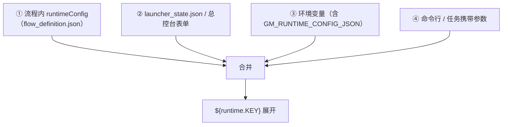

# E4 · 配置 · 运行参数 · 占位符字典

> 本篇回答：**值从哪来、`${runtime.xxx}` 这类占位符怎么展开、哪些配置含密钥**。
> 读者：写流程、配环境、做部署的人。

---

## 1. 配置的四个层级

| 层 | 载体 | 优先级 |
|---|---|---|
| ① | 流程定义的 `runtimeConfig` | 低 |
| ② | `launcher_state.json`、总控台运行时参数面板 | 中 |
| ③ | 环境变量（含 `GM_RUNTIME_CONFIG_JSON` JSON 串） | 高 |
| ④ | 命令行参数 / 远程任务携带的 `flowPath` 与项目参数 | 最高（远程场景以此为准） |

> 📌 **远程场景的硬纪律**：worker 必须以**任务携带的参数**为准，不能读本机默认。否则会出现"投递的是 A 流程、跑起来是 B 流程"（C5 §3.2）。

---

## 2. 占位符语法

解析入口：`WT_AUT_recorded._resolve_dynamic_value(value, step_id, context)`（L1800），经 `configure_flow_executor(resolve_dynamic_value=...)` 注入执行器，在 4 处被调用（L937 / L1218 / L1554 / L1683）。

| 形式 | 含义 | 示例 |
|---|---|---|
| `${runtime.KEY}` | 引用 `runtimeConfig` 的键 | `${runtime.sourceFilePath}`、`${runtime.synthesisDesc}` |
| `${stepParams.x}` | 引用**参数矩阵**当前行的字段 | `${stepParams.mastName}` |
| `${steps.<stepId>.<output>}` | 引用前序步骤的输出 | `${steps.step_3.value}` |
| `${KEY}`（裸键） | **历史兼容**：等价于 `${runtime.KEY}` | `${sourceFilePath}` |

> ⚠️ 新流程一律用 `${runtime.KEY}`；裸键仅为兼容存量流程保留。

### 2.1 控件名也支持占位符

`WT_AUT_recorded._get_flow_step_resolved`（L1063）会对 `controls` 做 `${...}` 动态解析，用于**跟随导入文件/设置命名变化的动态控件**（控件名随数据变化时的关键能力）。

### 2.2 ⚠️ 空值保留字面量（重要陷阱）

`_resolve_dynamic_value` 对**空串/None 保留字面量**（即不替换、原样留 `${runtime.xxx}`）。

**为什么**：`send_keys` 会把花括号 `{}` 当作按键码，若把空值替换成空字符串，可能吃掉原本有意义的文本。这是刻意设计。

**副作用与处理**：

| 场景 | 处理 |
|---|---|
| 名单类动作（`select_list_items` 等） | 入口检测 `${` 前缀 → 记警告并按**"全选/默认语义"**处理（未指定 = 全量）。`wt_flow_locator` L10285–10290 |
| `runtime.synthesisDesc` 未注入 | 回退到综合名称，避免 `send_keys` 把未解析的 `${...}` 花括号当按键码（L1821–1822） |

> 🚧 **不要改 resolver 的空值保护**——会影响所有文本键入。正确做法是在**消费方**做兜底。

---

## 3. 运行参数字典（`runtimeConfig`）

真实流程定义中出现的键：

| 键 | 含义 |
|---|---|
| `gmExe` | Global Mapper 可执行路径 |
| `sourceFilePath` | 源文件路径（DWG / 地形） |
| `outputDir` | 输出目录 |
| `projectionFilePath` | 投影文件路径 |

项目工作目录解析后可提供的键（`wt_project_workdir_parser.build_text_overrides`，L928–1065）：

| 键 | 含义 |
|---|---|
| `meteoName` / `mastName` | 气象对象名 / 测风塔名 |
| `elevation` / `latitude` / `longitude` | 海拔 / 纬度 / 经度 |
| `hubHeight` | 轮毂高度 |
| `wind50` | 50 年回归风速 |
| `airDensity` | 空气密度 |
| `domainCenterX` / `domainCenterY` / `domainRadiusR` | 计算域中心与半径 |
| `domainNwX` / `domainNwY` / `domainSeX` / `domainSeY` | 计算域西北/东南角 |
| `tisFilePath` / `tiFilePath` | 湍流强度文件 |
| `mastImportFilePath` | 测风塔导入文件路径 |

> 💡 这些键由 `wt_project_workdir_parser` 从甲方交付的工作文件夹自动识别（C7 §3.3），是"Simple 模式自动解析键入值"的基础。

---

## 4. 配置文件清单

| 文件 | 用途 | 是否入库 |
|---|---|---|
| `launcher_state.json`（根） | 总控台运行时状态：模型/端点/API Key、UI-TARS 路径、当前流程路径、Simple 模式开关、项目工作目录、队列地址 | ❌（含密钥与本机路径） |
| `resources/project_config.resource` | Robot Framework 变量文件（`${PROVIDER}`、`${MODEL_NAME}`、`${UI_TARS_*}`、`${GM_EXE}`、`${APP_START_WAIT}`、`${GM_READY_TIMEOUT}` …） | ✅（⚠️ 含本机绝对路径，历史遗留） |
| `resources/dispatch_keywords.resource` | Robot 关键字：初始化调度配置、准备 UI-TARS 配置、执行 WT 自动化流程 | ✅ |
| `external_capture_config.json`（根） | 外部采集适配器配置：`uiapeek_exe`、`axe_cli_exe`、`uiapeek_base_url`、`dotnet_root` | ✅（含本机路径，历史遗留） |
| `workspace/ui_scale.json` | 界面缩放档位，**所有 tkinter 窗口共用** | 运行时生成 |
| `WT_AUTOMATION_Agent/_gui_config.json` | Agent 运行配置 | ❌ |
| `WT_AUTOMATION_Agent/model_profiles.json` | LLM 模型档案（含 API Key） | ❌ |
| `control_maps/`、`image_templates/` | 资产（部分 `templates_index.json` 含绝对路径） | ✅ |

### 4.1 `launcher_state.json` 的键（**只列键名，不含值**）

| 分组 | 键 |
|---|---|
| 模型 | `apiKey`、`model`、`baseURL`、`useResponsesApi`、`recentModels` |
| UI-TARS | `repoRoot`、`configPath`、`enableAiIntervention` |
| 模板 | `templateAutoUpdate` |
| 流程 | `flowDefinitionPath`、`stepOrderByFlowPath` |
| Simple 模式 | `simpleModeFlows`、`simpleModeEnabled`、`simpleModeRemote` |
| 项目 | `projectWorkDir`、`projectParams` |
| 选项缓存 | `cpVersionOptions`、`turbineTypeOptions` |
| 远程 | `serverMonitorUrl`、`taskQueueUrl`、`taskQueueUser`、`taskQueueToken` |
| 其他 | `uiMode`、`updatedAt` |

> 🚨 **该文件含真实 API Key 与队列令牌，绝不能入库。** 示例中的 URL 端口：监控 `:8767`、队列 `:8768`（以实际部署为准）。

---

## 5. 环境变量一览

| 变量 | 用途 |
|---|---|
| `VOLC_API_KEY` / `UI_TARS_API_KEY` | AI 介入的 API Key（**优先 `VOLC_API_KEY`**） |
| `UI_TARS_VLM_BASE_URL` | VLM 服务地址 |
| `UI_TARS_MODEL` / `UI_TARS_USE_RESPONSES_API` | 模型与接口模式 |
| `UI_TARS_REPO_ROOT` / `UI_TARS_CLI_CONFIG` | UI-TARS 仓库与 CLI 配置 |
| `WT_UI_TARS_TIMEOUT_SECONDS` | AI 介入超时，默认 **600 秒** |
| `WT_ENABLE_AI_INTERVENTION` | 是否启用 AI 介入（`true`/`false`） |
| `WT_AI_INTERVENTION_LOG_LINES` | 回写日志行数（总控台置 10） |
| `GM_RUNTIME_CONFIG_JSON` | 以 JSON 串注入运行时参数（子进程占位符展开） |

---

## 6. 密钥与路径纪律

| # | 纪律 |
|---|---|
| 1 | **任何含 API Key / 令牌的文件不得入库**：`launcher_state.json`、`_gui_config.json`、`model_profiles.json` |
| 2 | 文档与代码中**不写本机绝对路径**；配置优先用相对路径或环境变量 |
| 3 | 新建 worktree 时，含密钥的三个文件需**人工从主目录拷贝**（`AGENTS.md` 检查单） |
| 4 | `resources/project_config.resource` 与 `external_capture_config.json` 目前含本机绝对路径（历史遗留），换机部署时需同步更新 |
| 5 | 队列 token 通过启动参数 `--auth-token` 提供，**禁止写入版本库** |

### 6.1 已核实状态（2026-09-11 实测）

用 `git ls-files` + `git check-ignore -v` + `git log -- <file>` 逐个核对：

| 文件 | 跟踪状态 | 提交数 | 结论 |
|---|---|---:|---|
| `launcher_state.json` | 未跟踪（`.gitignore:18`） | 0 | ✅ 安全，从未入库 |
| `external_capture_config.json` | 未跟踪（`.gitignore:98`） | — | ✅ 安全 |
| `WT_AUTOMATION_Agent/model_profiles.json` | 未跟踪（`.gitignore:26`） | — | ✅ 安全 |
| `WT_AUTOMATION_Agent/_gui_config.json` | 未跟踪 | — | ✅ 安全 |
| `resources/project_config.resource` | **已跟踪** | 2 | ⚠️ **含本机用户目录绝对路径** |

> 📌 **结论**：**没有密钥泄漏**。四类含密钥/令牌的文件全部被 `.gitignore` 正确覆盖且从未提交。
> 真正的问题是**本机绝对路径**——按 `AGENTS.md` 的纪律同样禁止入库，且本仓库 `origin` 为公开 GitHub 仓库，
> 已入库的路径属于历史遗留，清理需单独决策（见 §6.2）。

### 6.2 本机绝对路径的分布（2026-09-11 扫描）

在被跟踪文件中精确匹配 `Users\14830` / `Users/14830`，命中 **35 个文件**，分四类：

| 类别 | 数量 | 示例 | 清理难度 |
|---|---:|---|---|
| 源码默认值 | 6 | `WT_Launcher.py`、`wt_mast_config_xml.py`、`wt_project_workdir_parser.py`、`wt_spatial_domain_calc.py`、`diagnose_mup_windows.py`、`ui_tars_runner.js` | 低 |
| 配置与文档 | 5 | `resources/project_config.resource`、`内网同步说明.md`、`docs/01-架构与设计/simple_mode_params/*`、`docs/05-调试案例/典型问题记录/窗口漂移.txt` | 低 |
| 数据资产（上次运行残留值） | ~23 | `control_maps/**`、`flow_packages/**`（多数为 `runtimeConfig` 里的上次路径）、`samples/**` | 中 |
| 二进制 | 1 | `WT_AUTOMATION_Agent/Help_document/*.pdf` | 高（不可文本清理） |

> ⚠️ **重要前提**：`origin` 为公开仓库且 `main` 已推送，这些路径**已在公开历史中**。
> 从工作区删除**不会**清除历史；清历史需 `git filter-repo` / BFG 并**重写全部 commit**（影响所有协作者），属于需人工决策的高风险操作。

### 6.3 处置决策记录

| 日期 | 决策 | 说明 |
|---|---|---|
| 2026-09-11 | **暂不清理代码，仅在文档登记** | 路径泄漏危害有限（仅用户名，非密钥）。先止住增量，等有空再统一处理 |
| 2026-09-11 | **公开历史暂不重写** | `filter-repo`/BFG 会重写全部 commit、影响所有协作者；收益不抵风险 |
| 2026-09-11 | **主目录修改已授权** | 维护者知悉并授权：后续清理可在主目录进行，**仅限路径脱敏、不改逻辑** |

**"止住增量"的三条做法**（当前可执行，无风险）：

| # | 做法 |
|---|---|
| 1 | 新增代码/配置**一律不写本机绝对路径**：用 `${CURDIR}` / 相对路径 / 环境变量 |
| 2 | 数据资产里的 `runtimeConfig` 默认值**提交前清空**（它们是"上次运行值"，不应入库） |
| 3 | 写文档时路径一律用 `<仓库根>/…` 或 `<用户目录>/…` 占位 |

> 📌 重新评估时机：①仓库可见性变化（转私有/公开范围扩大）；②路径中包含更敏感信息（令牌、内网 IP、项目名）；③需要做一次历史清理时。

---

## 7. 配置优先级实践建议

| 场景 | 建议 |
|---|---|
| 本机开发调试 | 用总控台参数面板 + `launcher_state.json` |
| 批量/参数扫描 | 用 `param_table_*.json|xlsx` 的 `${stepParams.x}` |
| 远程无人值守 | **全部通过任务携带参数**下发；不要依赖服务机上的 `launcher_state.json` |
| 换机/内网部署 | 优先用环境变量（`GM_RUNTIME_CONFIG_JSON`）注入，避免改动文件 |

---

核验：2026-09-11 / 涉及：`WT_AUT_recorded.py`(L579, L679, L712, L990, L1059–1080, L1267, L1800–1842)、`wt_flow_executor.py`(L23, L937, L1218, L1554, L1683)、`wt_flow_locator.py`(L10285–10290)、`wt_project_workdir_parser.py`(L7, L928–1065)、`resources/project_config.resource`、`resources/dispatch_keywords.resource`、`external_capture_config.json`、`wt_dpi.py`(UI_SCALE_CONFIG_FILE)、`AGENTS.md`
