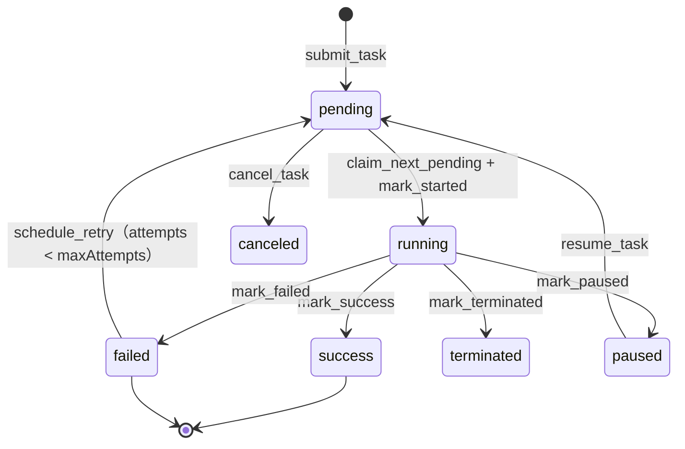
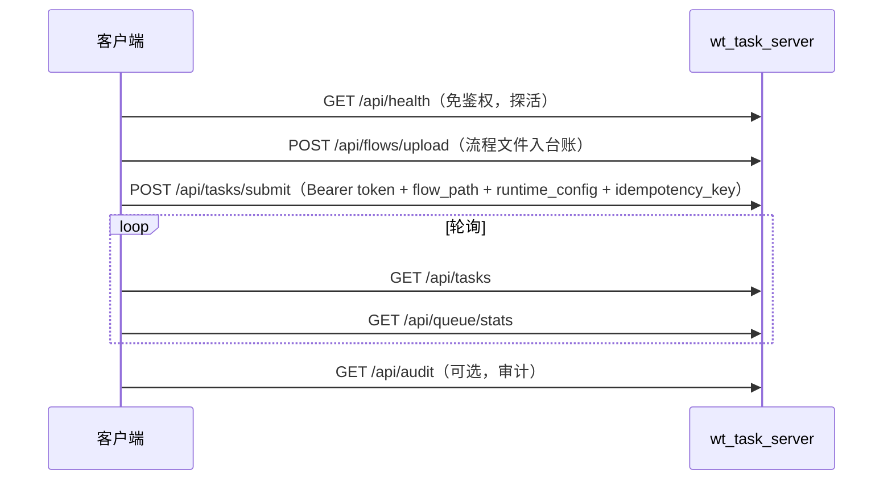

# E5 · 队列服务接口与协议

> 本篇回答：**HTTP 端点有哪些、怎么鉴权、任务字段是什么、状态怎么流转**。
> 读者：要把别的系统接进队列的人、运维。
>
> 组件职责与部署形态在 C5；操作步骤在 D6。

---

## 1. 传输与鉴权

| 项 | 说明 |
|---|---|
| 协议 | HTTP（`BaseHTTPRequestHandler` + `ThreadingHTTPServer`） |
| 鉴权 | **Bearer token**：`Authorization: Bearer <token>`；也接受查询串 `?token=` / `?authToken=` |
| 比较方式 | `secrets.compare_digest`（**定长时间比较**，防时序攻击） |
| 服务端配置 | `--auth-token` **必填**（`main()` L1936） |
| 免鉴权端点 | `/api/health`（在 `if not self._check_auth()` 之前处理，L1200） |
| 默认端口 | 队列服务 `:8768`、监控服务 `:8767`（以实际部署 `taskQueueUrl` / `serverMonitorUrl` 为准） |

> 🚨 token 通过启动参数提供，**禁止写入版本库**。

---

## 2. HTTP 方法

服务实现了 `do_GET` / `do_POST` / `do_PUT` / `do_DELETE` / `do_PATCH`（L1451–1474），按 `path` 前缀/相等分派。

### 2.1 只读端点（GET 分支，鉴权后）

| 端点 | 行号 | 说明 |
|---|---|---|
| `GET /api/health` | L1200 | **健康检查（免鉴权）** |
| `GET /api/queue/stats` | L1223 | 队列统计（`get_queue_stats`） |
| `GET /api/audit` | L1230 | 审计事件（`list_audit_events`） |
| `GET /api/flows` | L1247 | 流程列表 |
| `GET /api/flows/version` | L1250 | 流程版本台账 |
| `GET /api/tasks` | L1253 | 任务列表（支持筛选） |

### 2.2 写入端点（POST 分支，鉴权后）

| 端点 | 行号 | 说明 |
|---|---|---|
| `POST /api/tasks/submit` | L1434 | 提交单个任务 |
| `POST /api/tasks/batch-submit` | L1437 | **批量提交**（`submit_tasks_batch`） |
| `POST /api/flows/upload` | L1428 | 上传流程文件（进入版本台账） |
| `POST /api/flows/rollback` | L1431 | 流程回滚到历史版本 |
| `POST /api/maintenance/archive` | L1440 | 归档维护（`archive_completed_tasks`） |

---

## 3. 任务字段

### 3.1 提交参数（`submit_task` 签名，L348）

| 参数 | 类型 | 说明 |
|---|---|---|
| `user` | str | 提交者标识 |
| `flow_path` | str | **流程定义路径**（远程一致性关键字段） |
| `source_ip` | str | 来源 IP |
| `steps` | list | 指定执行的步骤；空表示全跑 |
| `from_step` / `to_step` | str | 步骤区间 |
| `priority` | int | 优先级 |
| `scheduled_at` | str | 定时投递时间（`_normalize_scheduled_at`） |
| `max_attempts` | int | 最大尝试次数（**≥1**） |
| `retry_delay_seconds` | int | 重试延迟（≥0） |
| `timeout_seconds` | int | 超时（≥0） |
| `notify_url` | str | 完成回调地址（`_validate_notify_url` 校验） |
| `runtime_config` | dict | 运行时参数（序列化为 `runtimeConfig`） |
| `idempotency_key` | str | **幂等键** |

> 💡 **幂等键很重要**：相同 `(user, idempotency_key)` 重复提交会**直接返回已有任务**（并标记 `idempotentReplay: true`），同时在 `tasks` 与 `tasks_archive` 两张表里查。网络重试时用它防重复排队。

### 3.2 任务对象字段（`_row_to_task`，L303）

数据库列为 snake_case，输出时经 `_COLUMN_TO_KEY` 映射为 **camelCase**：

| 字段 | 说明 |
|---|---|
| `task_id` / `id` | 任务 ID，形如 `task_20260911_143000_ab12cd` |
| `user` | 提交者 |
| `flowPath` | 流程路径 |
| `status` | 状态（§4） |
| `priority` / `attempts` / `maxAttempts` | 调度相关 |
| `stepsRequested` | JSON 数组（解析失败降级为 `[]`） |
| `runtimeConfig` | 对象（解析失败降级为 `{}`） |
| `scheduledAt` / `nextRetryAt` | 时间字段 |
| `retryDelaySeconds` / `timeoutSeconds` | 重试与超时 |
| `notifyUrl` | 回调地址 |
| `runId` | 本次运行 ID |
| `createdAt` / `startedAt` / `endedAt` / `updatedAt` | 时间戳 |
| `error` | 错误信息 |
| `pauseRequested` / `terminateRequested` | 控制标志（**强制 bool**） |
| `idempotencyKey` / `idempotentReplay` | 幂等 |

---

## 4. 任务状态机

| 状态 | 常量 | 说明 |
|---|---|---|
| `pending` | `STATUS_PENDING` | 等待 |
| `running` | `STATUS_RUNNING` | 执行中 |
| `paused` | `STATUS_PAUSED` | 已暂停 |
| `success` | `STATUS_SUCCESS` | 成功 |
| `failed` | `STATUS_FAILED` | 失败 |
| `canceled` | `STATUS_CANCELED` | 已取消 |
| `terminated` | `STATUS_TERMINATED` | 已终止 |



### 4.1 状态迁移 API

| 操作 | 函数 |
|---|---|
| 取下一个待办 | `claim_next_pending()` |
| 标记开始 | `mark_started(task_id, run_id=None)` |
| 进度更新 | `update_progress(...)` |
| 成功 / 失败 / 暂停 / 终止 | `mark_success` / `mark_failed` / `mark_paused` / `mark_terminated` |
| 请求暂停 / 终止 | `request_pause` / `request_terminate` |
| 取消 / 删除 / 恢复 | `cancel_task` / `delete_task` / `resume_task` |

> ⚠️ 非法状态迁移会抛 `TaskStateError`（L183）。

### 4.2 失败与重试

```
handle_failure(task_id, error)
  ├─ attempts < maxAttempts → schedule_retry（回到 pending，写 next_retry_at）
  └─ 否则 → mark_failed
```

`schedule_retry` 会重置 `started_at` / `run_id` / `ended_at`，并按 `retryDelaySeconds` 计算 `next_retry_at`。

### 4.3 孤儿回收

`recover_orphan_running_tasks(db_path, max_age_seconds=120)`：服务端把任务状态与子进程生命周期绑定在内存里，**进程退出后遗留的 `running` 任务会被回收**（默认超过 120 秒无进展）。

---

## 5. 流程版本台账

服务端维护流程文件的版本与校验和，确保 worker 跑的是预期版本。

| 函数 | 作用 |
|---|---|
| `_load_flow_version_ledger(flow_dir)` / `_save_flow_version_ledger(...)` | 台账读写 |
| `_version_file_name(name, number)` | 版本文件命名 |
| `_sha256_text(text)` | 内容校验和 |

端点：`GET /api/flows/version`、`POST /api/flows/upload`、`POST /api/flows/rollback`。

> 📌 这是"远程一致性"的保障之一：**流程文件先上传入台账，任务再引用它**，而不是让 worker 去读本机可能过期的一份。

---

## 6. 日志与审计

| 能力 | 函数 | 说明 |
|---|---|---|
| 任务日志追加 | `append_task_log(task_id, text, log_dir)` | 写到 `logs/tasks/` |
| 日志尾部读取 | `read_task_log_tail(task_id, tail=300, ...)` | `DEFAULT_TAIL = 300` |
| 日志路径 | `task_log_path(task_id, ...)` | |
| 日志清理 | `cleanup_task_logs(...)` | |
| 审计事件 | `add_audit_event(...)` / `list_audit_events(...)` | `GET /api/audit` 暴露 |
| 服务日志 | `log_server_event(message, log_path=DEFAULT_SERVER_LOG)` | 服务端事件 |
| 归档 | `archive_completed_tasks(days=30, limit=1000)` → `tasks_archive` | `POST /api/maintenance/archive` |

---

## 7. 监控服务（`wt_server_monitor`）

| 项 | 说明 |
|---|---|
| 端口 | `serve_forever(host="0.0.0.0", port=8767)` |
| 类型 | `MonitorHandler(BaseHTTPRequestHandler)`（L40）+ `MonitorServer(ThreadingHTTPServer)`（L149） |
| 定位 | **只读**：队列状态 + 日志尾部，供总控台 `ServerMonitorWindow` 拉取 |
| 注意 | 与队列服务是两个独立进程/端口，不要混用 |

---

## 8. 客户端接入方式

| 方式 | 载体 |
|---|---|
| 图形界面 | `WT_Launcher` → `wt_task_queue_window`（嵌总控台） |
| 命令行自检 | `python wt_queue_selfcheck.py --check <IP> [--token 令牌]` |
| 程序化 | 直接调 HTTP；`clientToken` 字段用于客户端身份标记（L819、L964） |

### 8.1 最小接入流程



---

## 9. 约束与边界

| 约束 | 说明 |
|---|---|
| **同机部署** | 队列服务与 worker 同主机，直连 SQLite；不是集群调度器 |
| **会话一致性** | worker 与 MUP 必须同 Windows 会话（C5 §7） |
| **token 必填** | 服务端 `--auth-token` 缺失即启动失败 |
| **幂等建议** | 批量/重试场景务必带 `idempotency_key` |

---

核验：2026-09-11 / 涉及：`wt_task_server.py`(L275–289, L819, L964, L1200–1253, L1428–1474, L1880–1944)、`wt_task_queue.py`(L19–41, L168–348, L998–1085, L1169–1326, L1382–1477)、`wt_server_monitor.py`(L40–193)、`wt_queue_selfcheck.py`
