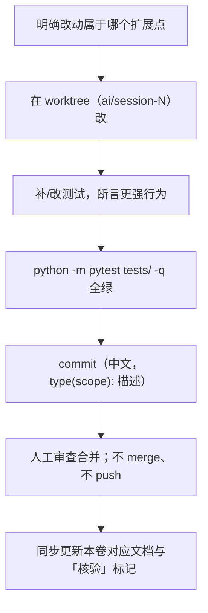

# E6 · Python API 与扩展点

> 本篇回答：**要加能力时该动哪里、动之前必须知道哪些约束**。
> 读者：二次开发者。**改代码前必读。**

---

## 1. 扩展点总图

| # | 扩展点 | 该动哪里 | 难度 |
|---|---|---:|---|
| 1 | 新增**动作**（action） | `wt_action_schema` → `wt_action_defaults` → 执行器 handler → `wt_flow_validation` → Excel 五处 | 中 |
| 2 | 新增**定位策略** | `wt_flow_locator`（候选生成 + 匹配 + 评分） | 中 |
| 3 | 新增**业务步骤** | `wt_business_steps`（`step_*` + 注册表） | 低 |
| 4 | 替换**外部桥接 / 后端** | `tools/external_capture/` 或注入的回调 | 中 |
| 5 | 新增**采集适配器** | `tools/external_capture/` + `merge` 工具 | 中 |
| 6 | 新增 **Agent 技能** | `WT_AUTOMATION_Agent/skills/*.md` | **极低** |
| 7 | 新增**报告字段** | `wt_run_reporting` | 低 |
| 8 | 新增**队列能力** | `wt_task_queue` + `wt_task_server` 端点 | 中 |

---

## 2. 依赖注入接线点（改代码前的核心知识）

> ⚠️ 根级核心库**互相 import**。为了规避循环依赖，统一采用「模块级 `lambda` 占位 + `configure_*()` 运行时注入 + 函数内延迟 import」。**不要把这些占位改成直接 import 同层模块。**

| 模块 | 注入入口 | 行号 |
|---|---|---|
| `wt_flow_executor` | `configure_flow_executor(...)`（24 个回调） | L144 |
| `wt_business_steps` | `configure_wt_business_steps(...)` | L31 |
| `wt_window_helpers` | `configure_wt_window_helpers(...)` | L25 |
| `wt_projection_helpers` | `configure_wt_projection_helpers(...)` | L38 |
| `wt_run_reporting` | `configure_run_reporting(base_dir=None, log_step=None)` | L15 |
| `wt_flow_executor`（控件库路径） | `set_control_map_path(path)` / `get_control_map_path()` | L53 / L59 |

**执行器的 24 个占位**（L20–47）覆盖了定位、点击、输入、勾选、列表、下拉、拖拽、滚轮、菜单、等待、上报、AI 介入、自动采模板——也就是说，**替换任意一项能力都只需换注入的回调，不必改执行器**。

**延迟 import 的位置**（示例）：`from wt_flow_locator import ...` 出现在 L531 / L562 / L621 / L683 / L743；`from pywinauto import Desktop` 在 L1014；`from mup_user_config import ...` 在 L1799。

> 💡 这套设计带来的直接收益：执行器可注入 mock 单测，**无需起 Tk 或真实 MUP**。

---

## 3. 扩展点 1：新增动作（action）

需要动 **5 处**，缺一处就会"配了不生效"或"保存即丢失"。

| # | 位置 | 要做什么 |
|---|---|---|
| 1 | `wt_action_schema.ACTION_SCHEMAS` | 加入条目：`label` / `description` / `target_required` / `input_required` / `input_key` / `input_label` / `show_timeout` / 可选 `suggested_columns` |
| 2 | `wt_action_defaults.ACTION_DEFAULT_CONFIGS` | 给 `timeoutSeconds` / `waitBefore` / `waitAfter` |
| 3 | `wt_flow_executor` | 加执行分支，并在 `configure_flow_executor` 增加对应注入回调（**签名变更要同步所有调用点**） |
| 4 | `wt_flow_validation.validate_step_definition` | 补该动作的专用校验（如有专用字段） |
| 5 | `flow_excel_io` | **Excel 往返五处同步**：列定义 / 规范化 / 写出 / 读入 / 清理 |

**同步义务**：`WT_AUTOMATION_Agent/schemas.py` 是动作 schema 的镜像，**也要同步**（C6 §10）。

> 🚧 **签名变更陷阱**：曾因 `configure_flow_executor` 签名缺参导致 `NameError` 阻断整个执行器。改公共函数签名务必全仓搜索调用点。

---

## 4. 扩展点 2：新增定位策略

定位不是"条件查询"，而是**全量遍历 + 加权评分**（B3）。新增策略要同时改三处：

| 层 | 位置 | 说明 |
|---|---|---|
| 候选生成 | `build_common_locator_candidates` | 决定候选顺序；命中第 N 项得 `120 − 10N` |
| 匹配 | `wrapper_matches_locator` | 新策略的匹配谓词 |
| 评分 | `get_control_definition_match_score` | 加分 / 惩罚 / 否决 |

**加减分设计原则**（照现有表推导）：

| 目的 | 建议 |
|---|---|
| 强身份证据（如 `automationId`） | 大加分（现 +14） |
| 结构签名（如 `children`） | 大加分且**不匹配要罚**（现 +24 / −18） |
| 弱线索（如 `ancestors`） | 小加分（现 +6），**只加分不否决** |
| 硬消歧字段（写在 `targetMethod` 里的 `label_text` / `ui_path`） | **不匹配直接 return −1** |
| 归属判断（窗口标题） | 超大惩罚（现 −160） |

**同时要注意**：

- fast 阶段有 `_candidate_strict_full_match` 早退门——新消歧字段要纳入"完整命中"判定（B3 §5.1）；
- 若策略需要 Raw View，走 `control_definition_expects_raw_view` 分支；
- 新增缓存要配套 TTL 与**窗口归属校验**（防缓存污染）。

---

## 5. 扩展点 3：新增业务步骤

`wt_business_steps.py` 提供过程式复合步骤：

1. 写 `step_xxx(context)`；
2. 在 `configure_wt_business_steps` 里接入所需依赖；
3. 在 `get_step_registry()` / `get_step_registry_map()`（L323 / L340）里注册。

**最佳实践**（源自源码约定）：

- 每个步骤函数要有清晰文档字符串，说明参数、返回值、异常与副作用；
- 对易失败的 UI 操作加**等待与重试**，超时与间隔可配。

---

## 6. 扩展点 4 / 5：外部桥接与采集适配器

| 项 | 约定 |
|---|---|
| 位置 | `tools/external_capture/`（包形态 + `capture.py` 统一入口） |
| 原则 | **不 import、不改默认链路**；纯补充 |
| 输出格式 | 与自有快照一致：`targetWindow` + `controlDefinitions[]`，文件名 `*_<adapter>_control_map.json` |
| 字段对齐 | 新增字段必须**三路 + merge 工具**同步，否则合并时静默丢字段（E3 §6） |
| 已知局限 | Axe.Windows 的 Scan API 只返回触规子集，**不能替代全量采集** |

---

## 7. 扩展点 6：Agent 技能（成本最低）

新增知识**优先写成 skill 文件**，而不是改代码：

```
WT_AUTOMATION_Agent/skills/<名称>.md
```

`skill_bridge.discover_skills` / `_load_md_skill` 会自动发现并加载。支持格式：`.md` / `.json` / `.xlsx` / `.csv` / `.pdf` / `.docx`。

---

## 8. 模块代理与延迟加载（编排层）

`WT_AUT_recorded` 用一组 `_*_get_...` 函数延迟加载核心模块，并用 `_make_module_proxy` / `_install_module_proxies`（L1372 / L1379）做代理：

```
_get_flow_locator(L1129) / _get_flow_executor(L1260) /
_get_wt_business_steps(L1294) / _get_wt_projection_helpers(L1322) /
_get_wt_window_helpers(L1341) / _get_wt_run_reporting(L1361)
```

**作用**：避免启动时一次性 import 全部重模块；也便于在 worker 场景下按需装配。

---

## 9. UI 扩展（tkinter 侧）

| 想做的事 | 该用什么 |
|---|---|
| 新窗口 / 对话框 | `_make_dialog_window(...)`（`WT_Flow_Editor` L74） |
| 按钮 / 卡片 / 徽标 / 滚动条 / 选择器 | `wt_theme` 的 `create_flat_button` / `create_card_frame` / `create_badge` / `create_modern_scrollbar` / `create_pill_selector` |
| 尺寸 | `wt_dpi.geometry(...)` / `wt_dpi.scale(...)`，**不要硬编码几何字符串** |
| 多画布滚轮 | `WheelRouter.register(canvas)` + `bind_root(root)` |
| 后台线程 → UI | `_ui_safe_call(cb)`（`root.after(0, cb)`） |

> 🚨 **Tk 与 COM 都不能跨线程**。详见 B1 §8 与 C2 §4.2。

---

## 10. 测试要求

| 项 | 要求 |
|---|---|
| 命令 | `python -m pytest tests/ -q` |
| 基线 | 742+ 用例，58 个顶层测试文件（C8 §5） |
| 门槛 | `AGENTS.md`：**合并前必须全绿**；因环境缺失导致的收集错误不算绿 |
| 新行为 | **必须补断言**，且断言"更强的新行为"，**禁止放宽断言掩盖回归** |
| 环境依赖 | `tests/test_control_live_detector.py` 依赖被 gitignore 的 `control_live_detector.py`，新 worktree 需人工拷贝 |
| 命名 | 按模块命名（`test_wt_flow_executor.py`）；按修复批次命名的见 C8 §5.2 |

---

## 11. 禁止事项（改动红线）

| # | 禁止 |
|---|---|
| 1 | 把 `lambda` 占位改成直接 import 同层模块（必引入循环依赖） |
| 2 | 在 `finally` 里 `gc.enable()`（会在收尾阶段触发原生崩溃，B1 §8） |
| 3 | 后台线程直接碰 Tk widget 或跨线程调用 COM |
| 4 | 把 API Key / 令牌 / 本机绝对路径写进被跟踪的文件 |
| 5 | 静默吞异常（P2 已知债，新增代码不得再犯） |
| 6 | 新增字段忘记同步：`normalize_step` 白名单、Excel 五处、三路采集适配器、`Agent/schemas.py` |
| 7 | 改公共函数签名不同步调用点 |
| 8 | 返回候选列表的函数在异常路径 `return None`（应 `return []`） |

---

## 12. 推荐工作流（改动落地）



---

核验：2026-09-11 / 涉及：`wt_flow_executor.py`(L20–47, L53, L144, L531–1799)、`wt_business_steps.py`(L31, L323, L340)、`wt_window_helpers.py`(L25)、`wt_projection_helpers.py`(L38)、`wt_run_reporting.py`(L15)、`wt_flow_locator.py`（候选/匹配/评分）、`WT_AUT_recorded.py`(L1129–1379)、`skill_bridge.py`(L58–366)、`wt_theme.py`、`wt_dpi.py`、`wt_wheel_router.py`、`AGENTS.md`
