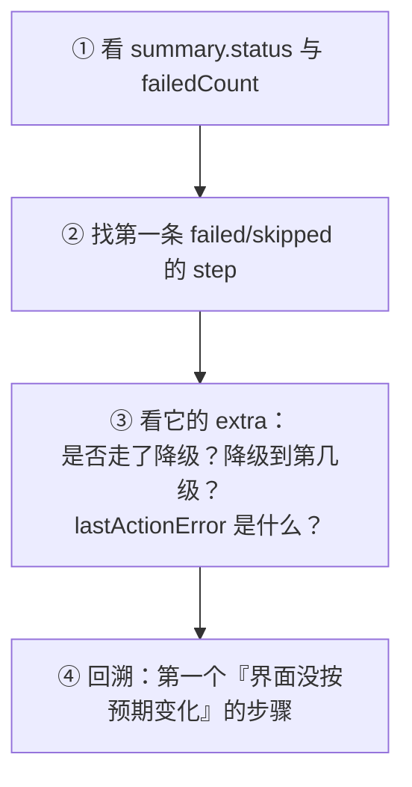

# F1 · 日志 · 运行报告与可观测性

> 本篇回答：**跑完之后去哪看、看什么、怎么从报告反推问题**。
> 读者：所有人。**排障的第一站是本篇，而不是源码。**
>
> 报告的产生逻辑在 C1 §11；本篇给**字段字典与读法**。

---

## 1. 可观测性出口一览

| 出口 | 路径 | 产出者 | 用途 |
|---|---|---|---|
| **结构化运行报告** | `logs/run_reports/<runId>.json` | `wt_run_reporting` | 一次运行的完整结果 |
| **最近一次报告** | `logs/last_run_report.json` | 同上 | **排障第一站** |
| 按塔报告 | `logs/run_reports/run_report_<塔名>.json` | 同上 | 多塔串行时避免被最后一塔覆盖 |
| 运行状态 | `logs/run_status.json` | `wt_run_status` | 供总控台/监控轮询 |
| 步骤日志 | logging 输出（`_LOG_STEP` 注入） | 全链路 | 人类可读的过程 |
| 任务日志 | `logs/tasks/<task_id>.log` | `wt_task_queue.append_task_log` | 远程任务的 tail |
| 服务日志 | `DEFAULT_SERVER_LOG` | `log_server_event` | 队列服务事件 |
| 审计事件 | `add_audit_event` / `GET /api/audit` | `wt_task_queue` | 谁在什么时候做了什么 |
| 失败证据 | `_write_failed_continue_when_evidence` | `wt_flow_executor` L769 | `continueWhen` 未满足时的值快照 |
| 流程反馈 | `_write_feedback_to_flow` | `wt_flow_executor` L94 | 降级恢复写回流程定义（自愈基础） |

---

## 2. 运行报告结构（`logs/last_run_report.json`）

### 2.1 顶层字段

| 字段 | 说明 |
|---|---|
| `runId` | `wt_run_YYYYMMDD_HHMMSS_<毫秒3位>_<进程内序号3位>`。**加毫秒+序号**是为了同一秒甚至同一 tick 内多次运行（快速重跑/双实例）不互相覆盖 |
| `startedAt` / `endedAt` | ISO 时间（秒精度） |
| `status` | `running` / `success` / **`partial_success`** / `failed` |
| `stepsRequested` | 本次请求的步骤列表 |
| `runtimeConfig` | 本次生效的运行时参数 |
| `stepResults[]` | 逐步结果（§2.2） |
| `summary` | 汇总（§2.3） |
| `error` | 顶层错误 |
| `reportPath` / `lastReportPath` | 报告落盘位置 |
| `mastReportPath` | 多塔场景按塔名额外落盘的路径（有塔名时才有） |

### 2.2 `stepResults[]`

```json
{
  "stepId": "step_14",
  "stepName": "点击-计算",
  "status": "success | failed | skipped",
  "actionType": "action",
  "strategy": "action",
  "elapsedSeconds": 1.234,
  "error": "",
  "extra": { }
}
```

**`extra` 里的关键诊断字段**（来自 A3 §5）：

| 字段 | 含义 |
|---|---|
| `attemptCount` / `retryCountConfigured` | 实际尝试次数 / 配置重试次数 |
| `lastActionError` | 最后一次动作异常 |
| `fallbackUsed` / `fallbackLevel` | 走了降级链 / 命中第几级 |
| `fallbackTemplateUsed` / `fallbackTemplateAttempted` | 模板兜底是否生效 / 曾尝试 |
| `fallbackReason` / `fallbackError` | 降级原因与异常 |
| `templatePreferred` / `templatePreferredAttempted` | 是否走"模板优先"路径 |
| `aiInterventionUnverified` | AI 介入结果**未经验证**（禁止记成功时会置位） |
| `onErrorHandled` | `onError` 处理方式（如 `continue` / `ask`） |

### 2.3 `summary`

| 字段 | 说明 |
|---|---|
| `requestedCount` | 请求步骤数 |
| `executedCount` | 实际执行数 |
| `successCount` / `failedCount` / `skippedCount` | 三类计数 |
| **`fallbackCount`** | **走了降级的步骤数**（`fallbackUsed` 或 `fallbackTemplateUsed` 任一为真即计） |
| `fallbackLevelCounts` | 按降级级别分组的计数（如 `{"1": 3, "2": 1}`） |
| `totalElapsedSeconds` | 总耗时 |

### 2.4 终态判定

`_resolve_final_status`（L112）：请求 `success` 但 `failedCount > 0` → 状态改为 **`partial_success`**。

> 💡 这是"流程报成功但中间有 failed 步骤"的**官方解释**：通常是某些步骤配了 `onError: continue`（B5 §7）。`partial_success` 是给你看的信号，不是 bug。

---

## 3. 落盘机制

| 机制 | 说明 |
|---|---|
| **原子写** | `_atomic_write_json`：先写临时文件再 `os.replace`，避免进程中断留下**截断的半截 JSON** |
| 双写 | 同时写 `logs/run_reports/<runId>.json` 与 `logs/last_run_report.json` |
| 多塔 | `runtimeConfig.mastName` 存在时额外落 `run_report_<塔名>.json`；同塔多次运行保留最新一份 |
| 收尾日志 | `运行结果摘要已写入: status=…, executed=…, success=…, failed=…, skipped=…, fallback=…, report=…` |

> 🚨 **如果看到这条摘要日志打出、报告也 `success`，但总控台仍报"执行失败"** → 多半是**收尾阶段的原生崩溃**（Tk 跨线程 / COM 跨公寓 / GC），进程以非 0 退出码死亡。详见 F2 §4。

---

## 4. 三步读报告法



| # | 动作 | 看什么 |
|---|---|---|
| 1 | **先看 `fallbackCount`** | >0 说明有步骤在**退化**。长期靠 L3/L4 命中 = 没修好（B5 §8） |
| 2 | 找第一条 `failed` | 它的 `error` 与 `extra.lastActionError` |
| 3 | 看 `elapsedSeconds` 异常大的步骤 | 可能触发了整树扫描（20–36 s，B3 §8） |
| 4 | 检查 `error` 是否含 `不可读值` / `未验证` 等关键字 | 分别对应模式 I 与 AI 未验证 |
| 5 | **回溯首因** | 报错步往往不是首因（B5 §1.2） |

---

## 5. 任务与服务侧日志

| 场景 | 怎么看 |
|---|---|
| 远程任务 | `read_task_log_tail(task_id, tail=300)`；文件在 `logs/tasks/` |
| 队列统计 | `GET /api/queue/stats` |
| 服务事件 | `DEFAULT_SERVER_LOG`（`log_server_event`） |
| 审计 | `GET /api/audit`（`add_audit_event` / `list_audit_events`） |
| 日志保留 | `--log-retention-days`；`cleanup_task_logs` |
| 归档 | `archive_completed_tasks(days=30, limit=1000)` → `tasks_archive` |

---

## 6. 给 Agent 用的诊断入口

`WT_AUTOMATION_Agent/log_diagnosis.py`：

```
load_run_report(path) → extract_failures(report) → build_diagnosis_prompt(log_text, flow_steps)
```

把 `logs/last_run_report.json` 喂给它，可以直接产出根因分析提示（D7 §6）。

---

## 7. 可观测性的已知缺口

| 缺口 | 影响 | 备注 |
|---|---|---|
| 无集中日志聚合 | 多机场景需各自看 | 当前部署形态是单机/单服务 |
| 无指标时序库 | 只能看单次报告，看趋势要自己汇总 | 可用 `summary.fallbackCount` 做简单趋势 |
| 报告只保留"最新" | `last_run_report.json` 会被覆盖 | 历史在 `logs/run_reports/<runId>.json`（按 runId 留存） |
| 部分异常被静默吞 | 表现为"匹配不到"而非报错 | 技术债 P2，见 F3 |

---

核验：2026-09-11 / 涉及：`wt_run_reporting.py`(全文 165 行)、`wt_run_status.py`、`wt_task_queue.py`(L1169–1326)、`wt_task_server.py`(`log_server_event`)、`wt_flow_executor.py`(L94, L769)、`WT_AUTOMATION_Agent/log_diagnosis.py`
