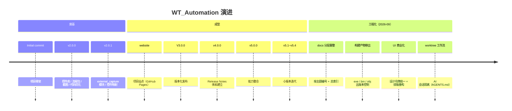

# F4 · 版本演进与路线图

> 本篇回答：**这套系统是怎么长成现在这样的**，以及**下一步值得做什么**。
> 读者：维护者、做规划的人。
>
> ⚠️ §4 路线图为**建议**，非既定计划，需维护者确认。

---

## 1. 版本现状

| 项 | 值 |
|---|---|
| 总提交数 | **57** |
| 发布标签 | `v2.0.0` → `V3.0.0` → `v4.0.0` → `v5.0.0` → `v5.1.0` → `v5.2.0` → `v5.3.0` → `v5.4.0` |
| 同步基准标签 | `wt_last_sync`（增量发布包用，非版本标签） |
| Release Notes | `RELEASE_NOTES_v4.0.0.md`、`RELEASE_NOTES_v5.0.0.md` |
| 远程 | `origin = https://github.com/hanago33/WT_Automation.git` |

---

## 2. 演进脉络

### 2.1 奠基期

| 里程碑 | 内容 |
|---|---|
| `Initial project commit` | 项目骨架 |
| `v2.0.0` | **控件库、流程包、截图**与代码优化——**资产体系成型** |
| `v2.0.1` | `external_capture` 模块、控件映射、启动脚本更新——**外部采集适配开始** |
| `Create website` / `Add project website` | 项目站点（GitHub Pages） |

> 💡 奠基期的核心成就是确定了**"资产外置"**这条路：控件、模板、流程全部数据化。后续所有能力（编辑器、Agent、生成器）都建立在这个前提上。

### 2.2 成型期（v3 ~ v5.4）

版本化发布体系建立（`RELEASE_NOTES_v4.0.0.md` / `v5.0.0.md`），能力逐步整合为今天的六层结构（A2）。

### 2.3 工程化期（2026-09，近期提交聚类）

从最近提交可以看出三条并行的线：

| 线 | 代表提交 | 意义 |
|---|---|---|
| **UI 商业化改造** | 总控台排版重构（Simple 双层工具栏 + Advanced 三 Tab 抽屉）、设计令牌接入控件采集/实时检测/模板制作器/流程编辑器、流程图现代下拉框与阴影节点、分割条平滑预览防抖、模式切换改用 `grid_remove`、全屏切换卡顿黑影治理、滚轮绑定补 `add="+"` | 从"能用的内部工具"走向"工业软件质感"（`wt_theme` 设计令牌是这轮的核心产出） |
| **文档与知识治理** | `docs` 按主题分层重整并同步全仓库引用、`docs` 总索引、Tk/Tkinter 社区调研交叉验证、AI session-1 合并审查报告 | 为本套技术文档体系铺路 |
| **仓库卫生与协作规范** | 移出大体积构建产物（`exe` / `bin` / `obj`）并补 ignore、MUP 手册中文译制备份入库、**建立 `AGENTS.md` worktree 隔离工作流** | 解决"多 AI 会话并发改主目录"的历史教训 |

> 📌 近期还修了几个典型工程问题：任务队列窗口滚动条先 `pack`（防窗口变窄时被 unmap 消失）、模板采集器全局滚轮绑定补 `add="+"`（避免拆掉其他绑定）。

---

## 3. 能力演进小结

| 能力 | 现状 | 卷 |
|---|---|---|
| 控件定位 | 复合定位 + 加权评分 + Raw View + 自愈 | B3 |
| 动作体系 | 19 种动作 + schema/defaults/validation 三层约束 | B2 / E1 |
| 容错 | retry → fallbackChain → 模板 → AI 四级降级 | B5 |
| 资产 | 控件库 173 / 模板 56 / 流程包 40 | C3 / C4 |
| 远程 | SQLite 队列 + HTTP 服务 + 监控 | C5 |
| Agent | NL→DSL + 技能 + 审计/修复/扫描 | C6 |
| 测试 | 742+ 用例 / 58 个文件 | C8 |
| 可观测 | 结构化报告 + 降级计数 + 反馈闭环 | F1 |

---

## 4. 路线图建议（待确认）

> 按"投入产出比"排序。**均为建议，需维护者拍板。**

### 4.1 近期（低成本、高收益）

| # | 事项 | 理由 | 参考 |
|---|---|---|---|
| 1 | **把 pytest 接进 GitHub Actions** | 742+ 用例的合并门槛目前**完全靠人工自律** | F3 §1 |
| 2 | **修 P1 采集落盘 / 合并路径** | 消除"采了不进库"的认知落差 | F3 §1 |
| 3 | 抽 `_launch_script` + 上提重复 helper + 统一 `_run_async` | 纯收益、低风险 | F3 §3 #3–5 |
| 4 | 清理根目录 `.tmp_*` 残留 | 与 `AGENTS.md` 不符 | F3 §1 |
| 5 | 新增模板/配置时用相对路径，止住路径增量 | 合规 | E4 §6.3 |

### 4.2 中期

| # | 事项 | 理由 |
|---|---|---|
| 6 | **ui_path 父链引导重定位** | 抵御父链中间节点变化，是定位鲁棒性的最大单点缺口 |
| 7 | 抽 `FlowDocumentService`（保存/校验脱离 Tk） | 让核心流程逻辑可单测 |
| 8 | 路径脱敏（35 个文件） | 合规与换机体验 |
| 9 | 运行报告趋势化（汇总 `fallbackCount`） | 现在只有单次报告，看不到"缓慢退化" |

### 4.3 长期

| # | 事项 | 理由 |
|---|---|---|
| 10 | `FlowEditorApp` 拆 Model / View | 等现有功能稳定后再做，避免重构期回归 |
| 11 | 拆分超大模型（`wt_flow_locator` 11 057 行等） | 长期可维护性 |
| 12 | 若 Meteodyn 官方开放可用 API，重估 RPA 路线 | 上层"流程定义 + 运行参数"抽象可保留，只换执行层 |

---

## 5. 决策记录

| 日期 | 决策 | 状态 |
|---|---|---|
| 2026-09-09 | 建立 worktree 隔离工作流（`AGENTS.md`）：AI 只在 `ai/session-N` 工作，不 merge / 不 push | 生效中 |
| 2026-09-09 | 移出大体积构建产物（`exe` / `bin` / `obj`）并补 `.gitignore` | 已完成 |
| 2026-09-10 | 便携 Python 3.11 升级包制作完成（`wt_python311_portable.zip`），支持一键切换与回滚 | 已完成 |
| 2026-09-11 | 技术文档体系建立（`docs/00-技术文档/`，六卷 38 篇） | 进行中 |
| 2026-09-11 | 路径泄漏：**暂不清理代码、仅文档登记**；公开历史**暂不重写** | 已决定（E4 §6.3） |

---

## 6. 相关文档

| 想看 | 去哪 |
|---|---|
| 缺陷与技术债明细 | F3 |
| 排障 | F2 |
| 报告与日志 | F1 |
| 现有架构 | A2 |
| 测试体系 | C8 |

---

核验：2026-09-11 / 涉及：`git log`（57 条提交）、`git tag`（v2.0.0 / V3.0.0 / v4.0.0 / v5.0.0–v5.4.0 / wt_last_sync）、`RELEASE_NOTES_v4.0.0.md`、`RELEASE_NOTES_v5.0.0.md`、`AGENTS.md`、`内网同步说明.md`
