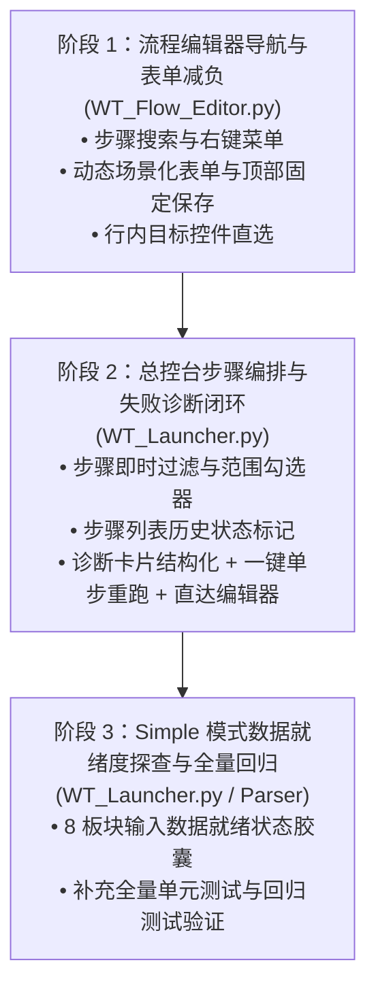

# WT Automation 第七期界面交互与高频操作深度优化规划书 (Phase 7)

> **规划定位**：严格遵循指示——**坚决不做边缘小工具的修修补补，紧抓日常最高频使用、直接影响操作体验与排错理解的核心痛点**。
> 本期聚焦两大核心主阵地：**`WT_Flow_Editor.py`（可视化流程编辑器）** 与 **`WT_Launcher.py`（自动化总控台）**，全部改造仅涉及**界面、UI、交互与操作逻辑优化**，完全不改变底层自动化执行引擎与业务逻辑。

---

## 一、 现状深入调研与高频痛点剖析 (Pain Points Analysis)

经过对项目日常核心工程实践（测风塔导入、地形配置、微观选址 CFT02、综合计算等数十步至上百步大型链路）的完整链路复盘，发掘出当前最折磨日常操作体验的 **4 大核心痛点领域**：

```
┌────────────────────────────────────────────────────────────────────────┐
│                      用户日常高频核心工作流与摩擦点                    │
└────────────────────────────────────────────────────────────────────────┘
          │
          ├─► 痛点 1: 流程编辑器 100 步滚动盲找与右键缺失
          │     └─ WT_Flow_Editor.py 步骤列表无搜索框，50~100 步只能靠肉眼滑轮上下翻找；
          │     └─ 步骤树右键没有任何反应，复制/克隆/禁用/删除必须抬鼠标点顶部小按钮。
          │
          ├─► 痛点 2: 流程编辑器 8 张巨卡垂直堆叠（视线与操作疲劳）
          │     └─ 改一个简单的按钮点击动作，屏幕却被 10 多个相对区域坐标、锚点偏移、
          │        前置判断、4 个大文本框塞满，垂直滚动条长达数千像素；
          │     └─ 选目标控件时，必须先滚到 Card 4 看控件，再滚回 Card 2 下拉选择。
          │
          ├─► 痛点 3: 总控台步骤列表无搜索、无范围勾选、无执行状态
          │     └─ WT_Launcher.py 步骤编排区挤在 310px 画布内，80 步完全无法按关键字过滤；
          │     └─ 想只跑中间第 15 到 25 步，必须手工一个个勾选或一个个取消，极其枯燥；
          │     └─ 跑完后步骤列表全白，不知道到底哪一步挂了，必须切到右侧报告页查看。
          │
          └─► 痛点 4: 运行报错与修复链路断裂（跨窗口排错摩擦极大）
                └─ 报告页点击失败步骤，只弹出一坨原始 JSON 字符串；
                └─ 想要修改该失败步骤，必须手动打开流程编辑器 -> 重新开文件 -> 重新翻找该步；
                └─ 想要单独重跑验证此步，必须回步骤列表重新取消其它几十步，极耗心智。
```

---

## 二、 核心重构支柱与设计方案 (Core Pillars)

### 支柱一：`WT_Flow_Editor.py` 步骤导航与高频编辑减负 (Pillar 1)

#### 1.1 步骤列表即时模糊搜索栏与状态筛选 (Step Search & Filter Bar)
- **位置**：位于 `step_tree` 正上方。
- **功能特性**：
  - **实时关键词过滤**：输入关键词（如 `测风塔`、`网格`、`click`、`btn_`），即时高亮或过滤仅显示匹配的步骤。
  - **快捷分类胶囊**：
    - `[全部 X 步]`
    - `[仅启用]` / `[仅禁用]`
    - `[仅动作步]` / `[仅子链路 flow_ref]`
    - `[带兜底模板]`
  - **匹配计数指示**：动态显示 `匹配 12 / 85 步`，支持 Esc 键一键清空搜索。

#### 1.2 步骤树完整右键上下文菜单 (Step Treeview Context Menu)
- **触发**：在 `step_tree` 任意步骤行上点击鼠标右键。
- **菜单动作**：
  - 📋 **复制步骤数据** (`Ctrl+C`)
  - 📑 **在下方粘贴步骤** (`Ctrl+V`)
  - 📄 **快速克隆副本** (`Ctrl+D`)
  - 👁️ **切换启用/禁用状态** (`Space`)
  - ➕ **在下方插入空白新步骤**
  - ⬆️ **上移步骤** (`Alt+Up`) / ⬇️ **下移步骤** (`Alt+Down`)
  - 🗑️ **删除所选步骤** (`Delete`)
  - 🏷️ **复制步骤 ID 到剪贴板**

#### 1.3 中间编辑表单场景化动态减负 (Contextual Action-Adaptive Form)
彻底解决“8 张大卡片铺满屏幕、修改一个属性要滚屏三次”的痛点：
- **常驻顶部摘要控制条 (Pinned Header Bar)**：
  - 显示当前步骤 ID、名称，以及**修改脏标记**（`● 未保存修改` / `✓ 已同步`）。
  - 固定放置 `[💾 保存并应用到步骤 (Ctrl+S)]` 与 `[↺ 重置表单]`，告别表单内部多处重复放按钮。
- **动作按需智能展开与收纳 (Action-Driven Dynamic Fields)**：
  - **普通动作模式 (如 click, mouse_click, wait, hotkey)**：
    - 自动隐藏相对区域 10 个数字框与锚点偏移框，首屏直接聚焦：`动作`、`目标控件`、`输入参数`。
  - **相对区域动作模式 (relative_click, relative_input)**：
    - 仅在此动作下平滑展开相对区域配置抽屉，自带高亮。
  - **锚点相对偏移模式 (anchor_offset_click)**：
    - 仅在此动作下展开对齐基准与 X/Y 偏移。
- **次要配置折叠收纳 (Collapsible Accordions)**：
  - **「⏱️ 等待、重试与续跑策略」折叠区**：默认收起为 1 行摘要（如 `前等待:0s | 后等待:1s | 超时:15s | 重试:0次`），点击展开微调。
  - **「📝 步骤说明与辅助备注」折叠区**：将原本占据半个屏幕的 4 个大文本框整合成 Tab 或精简卡片。

#### 1.4 目标控件选择行内直通 (Inline Target Control Picker)
- 在 `目标控件` 下拉框右侧直接增设：
  - `[🔍 浏览控件库]`：一键弹出已有且美化后的 `ControlPickerDialog`，选中即填入，不用再滚到最下方。
  - `[👁️ 悬停查看定位]`：胶囊悬停或点击弹出该控件的 `AutomationId / ClassName / UIPath`，无需切回控件库检查。

---

### 支柱二：`WT_Launcher.py` 步骤编排效率与范围选取 (Pillar 2)

#### 2.1 总控台步骤即时模糊过滤与「只看已选」
- **现状痛点**：Launcher Tab 1 的步骤框仅 310px 高，面对 80 个步骤时查找特定步骤极难。
- **优化设计**：
  - 在步骤列表工具栏上方新增紧凑型搜索栏：
    - `🔍 快速搜索步骤名称 / 步骤ID`。
    - **`[☑️ 仅看已选]` 切换开关**：勾选后瞬间隐藏未选步骤，用于最后复核“本次到底会跑哪些步骤”。

#### 2.2 范围批量勾选器 (Step Range Selector)
- **解决场景**：针对“我想跑第 12 步到第 28 步”、“我想跑中间导入阶段”的高频测试习惯。
- **设计**：
  - 工具栏新增 `[📐 范围选择]` 按钮。
  - 点击弹出轻量级范围选择对话框：
    - 起始步骤下拉/数字输入（默认第 1 步）。
    - 结束步骤下拉/数字输入（默认当前已选或尾部）。
    - 快捷预设按钮：`[前 10 步]`、`[后 10 步]`、`[仅选前半段]`。
    - 点击「应用勾选」，一键精准选中该连续区间，无需人工点按十几次。

#### 2.3 步骤列表行内历史运行状态标记 (Inline Run Status Dots)
- 在 Tab 1 步骤列表的每个 Checkbutton 旁，智能读取 `last_run_report.json`，点缀微型状态标记：
  - 🟢：上一次运行成功
  - 🔴：上一次运行失败/报错
  - ⚪：上一次未执行/跳过
- 用户在步骤列表即可对整个流程上次的健康状况一目了然，不需要频繁在左右面板切来切去。

---

### 支柱三：报错诊断结构化与单步排错闭环 (Pillar 3)

#### 3.1 运行报告详情卡片化 (Structured Diagnostic Card)
- 彻底废除 `run_report_detail_text` 中直接 dump 原始 JSON 字符串的做法。
- 替换为清晰、专业的工业级诊断卡片：
  - **头部状态栏**：大号步骤名、耗时胶囊（如 `⏱️ 15.2s`）、红/绿状态大徽标。
  - **核心错误聚焦**：突出显示错误核心（例如 `[超时] 控件 'btn_confirm' 在 15s 内未出现`，采用暖红提示底色）。
  - **关键参数速览**：动作名、目标控件、策略、阶段。

#### 3.2 闭环排错三大快捷动作 (Three Quick Fix Actions)
在诊断卡片底部直接提供 3 个高价值快捷按钮：
1. **`[▶ 仅单独重跑此步 (Run This Step Alone)]`**：
   - 一键直接调用 `start_selected_steps([this_step_id])`，**无需用户再去修改左侧复杂的勾选状态**！
2. **`[✏️ 在流程编辑器中打开该步 (Open in Flow Editor)]`**：
   - 携带当前流程路径与当前步骤 ID 启动/唤起 `WT_Flow_Editor.py`。
   - 编辑器启动后**自动高亮并选中该步骤**，直接进入编辑表单，实现“点击报错 -> 瞬间进入修复界面”的零摩擦体验！
3. **`[📂 打开现场截图/目录]`**：
   - 如果本步执行时触发了失败截图（在 `logs/screenshots/`），一键在 Windows 资源管理器中打开或直接调起图片查看器。

---

### 支柱四：Simple 看板模式数据就绪度前置感知 (Pillar 4)

#### 4.1 项目板块数据就绪度自动探查胶囊
- **痛点**：用户选完项目工作文件夹（`03-WT输入`）后，只知道目录选上了，但不知道 8 个板块各自的底层输入文件（DEM/TIM/XML/工程等）是否真的就绪。往往点击「运行所选板块」跑了几分钟才因为缺数据崩溃。
- **优化设计**：
  - 当项目工作目录更新时，后台轻量探查各个板块对应的数据特征：
    - `01 地形数据`：探查是否存在 `.dem` / `.tif` 栅格，就绪显示 `🟢 2 个高程文件就绪`；若空显示 `⚠️ 缺少高程文件`。
    - `02 气象数据`：探查是否存在 `CFT信息.txt` 及对应 `tim` 文件，显示 `🟢 3 塔数据就绪`；缺数据时显示 `🟡 缺少 CFT信息`。
    - `05 工程项目`：探查工程模板与坐标，显示 `🟢 坐标与参数就绪`。
  - 卡片顶部徽标由粗糙的“已配置”升级为**真实业务数据就绪状态**，真正实现“运行前心中有数，告别盲跑报错”。

---

## 三、 实施计划与里程碑 (Execution Roadmap)

整个优化划分为 **3 个清晰且可独立验证的阶段**，严格遵守 Worktree 隔离开发规范：



| 阶段 | 核心任务 | 涉及核心文件 | 预期体验改善 |
|---|---|---|---|
| **Phase 7.1** | **流程编辑器导航与表单减负** | `WT_Flow_Editor.py` | 100 步瞬时搜索过滤；右键完成克隆/启禁用；表单高度缩短 60%，告别来回滚屏。 |
| **Phase 7.2** | **总控台编排提效与诊断闭环** | `WT_Launcher.py` | 步骤搜索与批量区间勾选；失败直接一键重跑该步；一键直跳编辑器修改该步。 |
| **Phase 7.3** | **Simple 看板数据感知与全量测试** | `WT_Launcher.py`, `wt_project_workdir_parser.py` | 跑流程前一眼看清各个板块输入文件是否齐备；1500+ 测试全绿。 |

---

## 四、 风险防范与安全边界 (Safety & Backward Compatibility)

1. **绝对不碰执行引擎核心**：
   - 流程定义 JSON schema、`wt_flow_executor.py`、`wt_flow_locator.py`、`WT_AUT_recorded.py` 的底层核心执行逻辑维持原状。
   - 所有改动严格限定在 UI 层、交互事件响应层和辅助诊断信息渲染层。
2. **完全兼容现有配置文件与数据**：
   - 保持现有的 `flow_definition_*.json`、`launcher_state.json`、`last_run_report.json` 完全兼容。
3. **隔离开发与测试把关**：
   - 在独立的 worktree `WT_automation_ai7`（分支 `ai/session-7`）开展实现。
   - 编写专门的单元测试，并在提交前确保全库 1500+ 测试套件 100% 通过。
   - 遵循用户指令：**未获审批不改代码，未经要求绝不推送 GitHub**。

---

> 规划书已生成完毕，等待人类专家审查与指导。请指示是否同意按此规划启动实施！
